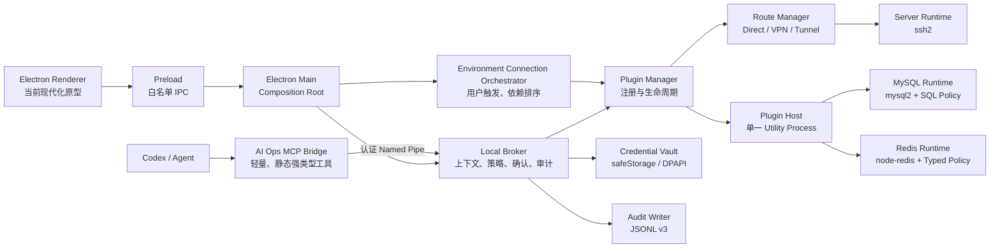
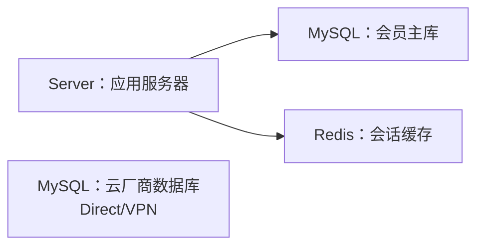
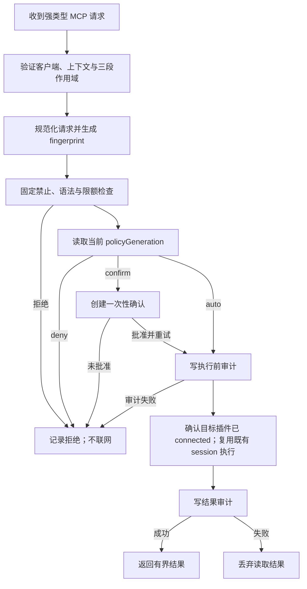

# Agent 运维工作台 V1 详细设计

> 状态：V1 实现基线 v1.0（已落地；现行 MCP/UI 已统一到 V2 入口，数据迁移兼容层仍保留）
> 更新日期：2026-08-16
> 产品依据：`ai-ops-plugin-environment-prototype.html`、`ai-ops-environment-connect-initial-1280.png`、`ai-ops-environment-connect-partial-1280.png` 与 `ai-ops-environment-connect-connected-1280.png`
> 目标：记录 V1 的产品决策、实现契约、安全边界、迁移方法与验收基线。

现行入口为 `renderer/v2`、`src/mcp-v2.mjs`、`src/workspace-store.mjs` 与插件运行模块。旧 `src/mcp.mjs` 和 renderer 根目录 UI 已移除；`ProjectStore`、`CredentialStore` 等仍参与启动或数据迁移的兼容层继续保留，不能按死代码处理。

当本文与旧文档 `plugin-data-source-architecture.md` 冲突时，以本文为准。旧文档中的“SSH 是项目主线”“项目授权会话”“enabled / aiAccess / Agent 暂停”等模型不再沿用。

## 0. 已确认的产品决策

以下决策已经确认，后续实现不得自行改变：

| 决策 | 最终规则 |
| --- | --- |
| 部分连接成功 | 成功插件立即可供 Agent 使用；失败或 blocked 插件单独不可用，不因环境整体 partial 而拦截成功项 |
| 自动重连范围 | 仅自动恢复用户本次启动后主动连接、且没有手动断开的环境 |
| 应用重启 | 所有环境恢复未连接；不得从配置、UI 状态或审计恢复连接意图并自动出站 |
| IPv4/IPv6 | 默认 IPv4 优先，网络层不可达后尝试 IPv6；另支持仅 IPv4、IPv6 优先、仅 IPv6 |
| README 为空 | 只提示缺少运维说明；不阻止人工连接，也不阻止已经允许的安全只读操作 |
| README 的作用 | 只提供环境上下文，不能增加权限、改变目标、放宽固定禁止或触发命令 |
| Agent 的连接权限 | Agent 不能连接、断开、重试环境，也不能修改插件、路由、权限、README 或凭据 |
| Server 操作 | 不提供任意 Shell；Agent 只能调用内置 `actionId` 与经过 Schema 校验的结构化参数 |
| 日志和配置 | 通过预配置 `sourceId`、短期 `fileId` 和有界读取访问，不允许任意远端路径 |
| 产品结构 | Project → Environment → Plugin；Server/MySQL/Redis 都是同级插件，SSH 不是项目主轴 |

## 1. 方案结论

V1 继续使用现有 Electron 桌面端、每用户 Named Pipe Broker、MCP Server、`ssh2` 与 Windows `safeStorage`，不嵌入 Tabularis、DBX 或其他数据库桌面壳。

核心模型改为：

```text
Project（业务项目）
└── Environment（用户自定义环境）
    ├── README.md（该环境独立运维说明）
    └── Plugin Instance[]
        ├── Server
        ├── MySQL（一个插件固定一个 database）
        └── Redis（一个插件固定一个 logical DB）
```

| 项目 | V1 决策 |
| --- | --- |
| 产品主线 | 以插件为主，SSH 只是 Server 插件的连接能力 |
| 环境 | 名称完全由用户定义，不内置生产/测试/开发枚举 |
| 运维说明 | 每个环境独立 `README.md`，Agent 打开环境时加载 |
| MySQL 粒度 | 一个插件等于一个明确数据库；同一物理 MySQL 的两个库也是两个插件 |
| Redis 粒度 | 一个插件等于一个明确逻辑 DB |
| SSH 隧道 | MySQL/Redis 只能复用同环境 Server 插件，不重复输入 SSH 配置 |
| Agent 总开关 | 删除；可调用能力只由逐项操作权限决定 |
| 连接 | 打开项目不联网；用户以环境为单位一键连接/断开全部 `configState=ready` 插件，draft 跳过 |
| 权限 | `自动允许 / 每次确认 / 禁止`；系统固定禁止不可配置 |
| MCP | 只暴露强类型工具，Agent 不能传 host、port、route 或凭据 |
| UI | 轻量原生 HTML/CSS/JS，事件驱动、按需加载，不做数据库 IDE |

## 2. 范围

### 2.1 V1 包含

- 项目、环境、插件的增删改查与排序。
- 以 Environment 为单位的一键连接、进度、部分成功、重试失败项和反向断开。
- 每环境独立 `README.md`。
- Server：结构化状态检查、日志查询、脱敏配置读取、受控下载、安全诊断及隧道提供。
- MySQL：表结构、只读查询、执行计划。
- Redis：SCAN、类型化读取、TTL。
- 数据插件的 Direct、Windows VPN Guard、同环境 Server Tunnel。
- Server 上行的 Direct、SOCKS5、HTTP CONNECT、Windows VPN Guard。
- 操作三态权限、一次性确认、上下文授权、审计、限额和超时。
- v0.3.2 SSH 项目的可恢复迁移。

### 2.2 V1 不包含

- SQL 编辑器、完整 Schema 树、结果表格浏览器或数据库管理 IDE。
- MySQL 写入、DDL、跨库查询、多语句。
- Redis 任意命令、写入、脚本或管理命令。
- Agent 修改项目配置、权限或凭据。
- Agent 任意 Shell、任意可执行文件或解释器入口。
- Server 上传、删除或修改远端文件，以及服务/进程/系统/网络变更。
- Agent 任意创建端口转发。
- 第三方动态插件市场；V1 只运行内置信任插件。
- 自动根据环境名称判断安全级别。
- 跨环境复用 Server、自动降级公网直连、隐式选择第一个环境或数据库。

## 3. 领域模型与强约束

### 3.1 不可变身份

- `projectId`：项目身份。
- `environmentId`：环境身份。
- `pluginInstanceId`：插件实例身份。
- `pluginType`：`server | mysql | redis`。

所有关系使用不可变 ID，名称只用于展示。重命名项目、环境或插件不改变目录、引用、权限归属或历史审计。

### 3.2 约束

1. 一个 Plugin Instance 必须且只能属于一个 Environment。
2. MySQL Plugin 固定一个非空 `database` 字符串，Schema 不接受数组。
3. Redis Plugin 固定一个 `db` 整数。
4. `serverTunnel` 只能引用同项目、同环境、类型为 Server 且允许提供隧道的插件。
5. 引用约束在配置保存和每次调用前各验证一次。
6. Server 被依赖时禁止删除，绝不自动把依赖者改为 Direct。
7. Environment 有任意插件、运行任务或活动连接时禁止删除，不级联删除。
8. Environment 名称不代表权限，名为“测试”的环境也不会自动放宽规则。
9. UI 当前选择不参与 Agent 授权；每次调用显式指定项目、环境和插件。
10. README 是操作上下文，不是安全策略。真正边界位于 Broker、插件策略、OS/数据库账号和网络路由。

## 4. 总体架构



| 层 | 负责 | 明确不负责 |
| --- | --- | --- |
| Renderer | 展示、表单、确认、局部状态 | 不持有秘密，不做最终权限判断，不直连目标 |
| Preload | 显式 IPC 白名单、输入结构初验 | 不提供任意 invoke，不暴露 Node API |
| Main | 装配服务、窗口、safeStorage、UI 事件 | 不承载大结果渲染 |
| Broker | MCP 身份、上下文、策略、确认、审计编排 | 不信任 UI/Agent 传入的目标和路由 |
| Environment Orchestrator | 用户触发的一键连接、依赖排序、进度、重试和反向断开 | 不签发 Agent 权限，不持久化自动连接状态 |
| Plugin Manager | 注册、配置验证、运行实例、依赖 | V1 不加载任意第三方脚本 |
| Route Manager | 统一 TCP 路由与受控 relay | 不暴露通用代理或任意端口转发 |
| MCP Bridge | 向 Agent 暴露固定、简短的工具 Schema，并转发到每用户 Broker | 不加载数据库驱动，不保存项目目录，不随项目动态生成工具 |
| Plugin Host | 数据库驱动和结果归一化 | 不访问项目文件，不持久化秘密 |

建议以一个按需启动的 Electron `utilityProcess` 承载 MySQL/Redis，而不是每插件一个进程。Alpha 可先在主进程内实现相同接口，但进入 Beta 前迁入单一 Plugin Host，以隔离解析/驱动故障且避免多进程常驻。

每个 Agent 客户端只启动轻量 MCP Bridge；真正的 SSH session、数据库驱动、路由、凭据和审计都集中在一个桌面 Broker/Plugin Host 中。多个 Agent 任务不会各自启动一套 MySQL/Redis Runtime，也不会运行第二个 AI 模型。Bridge 退出不影响桌面内已经由用户连接的环境；桌面主进程退出则关闭全部连接。

## 5. 本地存储

### 5.1 目录

```text
%LOCALAPPDATA%\AIOpsTool\
├── projects\
│   └── <projectId>\
│       ├── project.yaml
│       ├── environments\
│       │   └── <environmentId>\
│       │       ├── environment.yaml
│       │       ├── README.md
│       │       ├── docs\
│       │       └── plugins\<pluginInstanceId>.yaml
│       ├── audit\operations-YYYY-MM.jsonl
│       ├── downloads\
│       └── migration\
├── credentials\credentials.enc.json
├── state\ui-state.json
└── backups\
```

- YAML 保存声明式业务配置。
- README 保存环境运维上下文。
- safeStorage envelope 保存秘密。
- JSONL 保存追加式审计。
- JSON 保存非安全性的 UI 最近选择。
- SSH session、数据库 socket、relay 端口、延迟只存在内存。
- `desiredConnected`、插件运行态、重试队列、DNS 结果、network generation 和 relay lease 禁止写入 `ui-state.json`、配置或审计恢复字段。

V1 延续 JSONL 以复用现有实现并避免 Electron 原生数据库打包风险。采用月度轮转、串行写入和环境轻量索引；当单项目达到十万级记录后再评估 SQLite 索引。

### 5.2 配置示例

```yaml
# project.yaml
schemaVersion: 2
projectId: prj_member
name: 会员服务
revision: 12
environmentOrder: [env_east, env_gray, env_daily]
```

```yaml
# environment.yaml
schemaVersion: 1
environmentId: env_east
projectId: prj_member
name: 华东正式
revision: 7
runbook: README.md
pluginOrder: [srv_app, mysql_member, redis_session]
```

```yaml
# plugins/mysql_member.yaml
schemaVersion: 1
pluginInstanceId: mysql_member
pluginType: mysql
projectId: prj_member
environmentId: env_east
displayName: 会员主库
revision: 9
configState: ready
target:
  host: 127.0.0.1
  port: 3306
  database: member
transport:
  kind: serverTunnel
  serverPluginInstanceId: srv_app
auth:
  username: member_reader
  credentialRef: secret:mysql/mysql_member
tls:
  mode: preferred
network:
  addressFamily: ipv4Preferred
policy:
  describe: auto
  select: auto
  explain: auto
limits:
  maxRows: 100
  maxBytes: 1048576
  timeoutMs: 10000
  maxConcurrency: 1
```

系统固定禁止不写入 YAML。用户手工加入 `write: auto` 时，Schema 必须拒绝整个配置，而不是忽略。

### 5.3 原子保存

```text
读取当前 revision
→ 校验 If-Match/revision
→ 规范化配置
→ Schema 与引用完整性校验
→ 写同目录临时文件
→ flush + 回读校验
→ atomic rename
→ revision + 1
→ 发布 configChanged
```

同一项目使用串行写锁。冲突返回 `CONFIG_REVISION_CONFLICT`。密码字段留空表示保留旧凭据；删除凭据必须是独立明确动作。

## 6. 插件内核

V1 注册表是编译期固定的：

```text
server → config schema + runtime + policy manifest + UI schema
mysql  → config schema + runtime + policy manifest + UI schema
redis  → config schema + runtime + policy manifest + UI schema
```

Manifest 声明类型、配置 Schema、可配置 capability、默认三态、固定禁止、硬上限、诊断步骤和表单元数据。配置只保存用户可变规则；固定禁止只能来自内置 manifest 与 Broker 实现。

统一运行语义：

```text
validateConfig
describePublicResource
testConnection
diagnose
invokeTypedCapability
closeIdleSession
closeAll
```

MCP 不调用通用 `pluginInvoke`；Broker 内部可以使用统一接口，但外部只能调用显式映射的强类型工具。

连接相关状态严格拆成四层，不能复用同一个 `ready` 字段：

| 层 | 状态 | 是否持久化 | 用途 |
| --- | --- | --- | --- |
| Plugin Config | `draft \| ready` | 是 | 配置是否完整、是否进入连接分母 |
| Environment Intent | `desiredConnected: boolean` + `intentGeneration` | 否 | 用户本次应用运行期间是否明确要求保持连接 |
| Environment Runtime | `disconnected \| validating \| connecting \| connected \| partial \| failed \| reconnecting \| disconnecting` | 否 | 环境汇总状态，仅用于编排和显示 |
| Plugin Runtime | `disconnected \| waitingDependency \| connecting \| connected \| reconnecting \| blocked \| error \| disconnecting` | 否 | 真实插件是否可调用及失败原因 |

每个插件运行态同时记录：

```text
reason, retryable, attemptId, intentGeneration,
observedNetworkEpoch, routeBindingGeneration,
providerGeneration, lastTransitionAt
```

- 应用启动、打开项目、切换环境、打开 README、调用 `open_environment` 都不连接目标。
- 只有用户点击当前环境的“连接环境”，Environment Connection Orchestrator 才将 `desiredConnected` 设为 true 并建立连接。
- Agent/MCP 无权触发首次连接、重试或断开；目标插件未连接时直接返回插件级错误。
- MySQL 默认连接上限 1，Redis 默认单客户端，按插件隔离。
- 环境保持连接期间维持 Server/数据库基础 session；可以回收单次操作 channel、结果游标和临时读取句柄，但不得让 Agent 请求重新建立一个未连接插件。
- 用户手动断开或桌面主进程退出时关闭该环境全部 session；软件重启后 `desiredConnected` 永远从 false 开始。
- Server 断开只阻塞依赖它的插件，Direct/VPN 插件不受影响。
- 不做固定全局轮询；状态由连接编排、网络事件和驱动事件推送。

### 6.1 环境连接编排

每个 Environment 有独立、仅存在内存的 Runtime Session：

```text
disconnected
→ validating
→ connecting
→ connected | partial | failed

connected | partial | failed
→ reconnecting
→ connected | partial | failed

任意活跃状态
→ disconnecting
→ disconnected
```

聚合规则：

```text
eligible = configState=ready 的插件数量；draft 不计入分母
connected = eligible > 0 且全部插件 connected
partial   = 0 < connectedCount < eligible
failed    = eligible > 0 且 connectedCount = 0
empty     = eligible = 0，此时保持 disconnected(reason=NO_CONNECTABLE_PLUGIN)
```

`connected/partial/failed` 不是 Agent 授权，也不写入配置。`partial` 时已成功插件立即可供 Agent 调用，`error/blocked` 插件单独不可用；环境汇总状态不能成为拦截成功插件的全局门槛。

Runtime Session 至少包含：

```text
scopeKey = projectId/environmentId
desiredConnected
intentGeneration
observedNetworkEpoch
connectAttemptId
phase
eligibleCount / connectedCount / errorCount / blockedCount / draftCount
plugins[pluginInstanceId]
```

`intentGeneration` 防止手动断开与旧回调竞争；进程级 `networkEpoch` 只负责排序网络快照，每条 route 独立的 `routeBindingGeneration` 才决定哪些插件需要重连；`connectAttemptId` 隔离本次人工连接或重试。

任何异步连接结果在提交状态前必须重新匹配：

```text
projectId/environmentId/pluginInstanceId
intentGeneration + connectAttemptId
environmentRevision + pluginRevision/bindingHash
routeRevision + routeBindingGeneration
credentialRevision + providerGeneration
```

任一不匹配都销毁刚建立的 socket/relay，不得写入 connected。这样配置修改、换路由、换凭据或 Server 重建前发出的迟到回调不会复活旧目标。

点击“连接环境”时：

1. 先只读校验 project/environment 作用域、`expectedRevision`、ready 插件数量和依赖 DAG；revision 冲突、循环依赖或无 eligible 插件时直接返回，`desiredConnected` 保持 false 且零网络 I/O。
2. 生成不可变连接快照，固定每个插件的 revision/bindingHash、route/credential revision、provider 引用和候选清单；draft 标记“待配置”并跳过。
3. 在环境锁内原子提交 `desiredConnected=true`、新的 `intentGeneration/connectAttemptId` 和快照。只有提交成功后才允许任何目标网络 I/O。
4. 按插件完成凭据可用性等本地 preflight；单插件失败进入 error，不撤销用户对其他插件的连接意图。若环境级 preflight 异常导致编排无法开始，则原子回滚 intent、递增 generation 并保持零网络 I/O。
5. 以依赖 DAG 调度，而不是把所有 Server 串成一个全局阶段：Server 与 Direct/VPN 数据插件都是零插件依赖节点，可在全局限流下并行。
6. 每个 `serverTunnel` 数据插件只等待自己引用的 Server；对应 Server connected 后才建立 relay。
7. relay 建立后完成 MySQL/Redis TCP、TLS、认证和固定资源检查。
8. Server 失败时，其依赖闭包标记 `blocked(TUNNEL_PROVIDER_UNAVAILABLE)`，不得向数据库端点发起任何连接；其他独立插件继续。
9. 聚合每个插件结果，形成 connected、partial 或 failed，不因一个插件失败回滚独立成功连接；`eligible = connected + error + blocked`。
10. UI 显示 `已连接 x / 总计 y`、draft、error、blocked 数量和“仅重试失败项”。

连接仅做握手和轻量健康检查：Server SSH ready、MySQL `SELECT 1`/目标库身份、Redis PING/固定 DB；不会读取日志、Schema、Key 或业务数据。

依赖示例：



当 Server 连接失败时，M1/R1 显示 `blocked: TUNNEL_PROVIDER_UNAVAILABLE`，D1 仍可连接。环境状态为 partial。

### 6.2 断开、取消、失败重试与依赖恢复

- 点击“断开环境”时，第一步是将 `desiredConnected=false` 并递增 `intentGeneration`；然后取消 timer/DNS/socket，再按反向拓扑关闭 MySQL/Redis → relay → Server。超时后强制销毁。
- 旧 generation 的连接成功回调不得把已经手动断开的环境复活。
- 首次连接中点击取消时，原子设置 `desiredConnected=false`，递增 `intentGeneration/connectAttemptId` 并触发 cancel token；关闭本次 attempt 新建的全部 session，再回到 disconnected。
- 在 partial/failed 状态执行“重试失败项”，集合是“所有 error 插件 + 所有失败 provider 的 blocked 依赖闭包 + `MANUAL_RECONNECT_REQUIRED` 的目标闭包”，其中也包括 Server 已 connected、但自身认证失败的 Tunnel 数据插件。已经 connected 的插件保持原 session 和 attempt 计数；人工重试使用新的 attempt-local 预算，不受上一次自动重连预算耗尽影响。
- 取消一次失败项重试时，保持 `desiredConnected=true`，但递增 `connectAttemptId`/cancel token，销毁本次重试新建的资源并恢复重试前成功基线；迟到回调不得提交。
- Server session generation 变化或掉线时，必须先关闭所有 dependent 数据库 socket 与 relay，再把依赖插件标为 blocked/reconnecting；Server 恢复后按 Server → relay → DB 顺序重建。
- 多个依赖插件可以共享一个 Server SSH session，但每个数据插件持有独立 relay lease、数据库 session、限额、游标和取消句柄。
- 配置、凭据、route 或依赖发生变化时，关闭目标插件及其依赖闭包，标记 `MANUAL_RECONNECT_REQUIRED`；UI 提供“应用更改并重连”，也可由“重试失败项”覆盖该集合。只有用户动作能应用，Network Watcher 不得把新配置静默套入旧连接。
- 多个环境可以分别显式连接；切换页面不会替用户连接或断开。每次 MCP 调用仍按环境 ID 严格隔离。

### 6.3 桌面连接 API 与事件

只有 Renderer 经白名单 IPC 可以改变连接意图：

```text
environment.getRuntime(projectId, environmentId)
environment.connect(projectId, environmentId, expectedRevision)
environment.retryFailed(projectId, environmentId, connectAttemptId)
environment.cancelConnect(projectId, environmentId, connectAttemptId)
environment.disconnect(projectId, environmentId, intentGeneration)
```

主进程向 UI 推送局部事件：

```text
environmentRuntimeChanged
pluginRuntimeChanged
networkCoordinationChanged
```

提交时必须复核 project/environment 归属和 revision；MCP 没有同名工具。桌面的“检查连接”是一次有界诊断，不改变 `desiredConnected`、不把插件标记为 connected，也不等同于环境一键连接。

## 7. 路由与隧道

数据插件 transport：`direct | windowsVpn | serverTunnel`。Server uplink：`direct | socks5 | httpConnect | windowsVpn`。

```text
本机 → Server（可经 SOCKS5/HTTP/VPN）→ SSH forwardOut → MySQL/Redis
本机 → Direct → 云数据库
本机 → Windows VPN Guard → 云数据库
```

任何 transport 都不自动 fallback：Tunnel/VPN/Proxy 失败时绝不切换 Direct。IPv4/IPv6 的地址族尝试只发生在同一个已选 transport 内，不属于路由降级。

数据库驱动统一连接短期 loopback relay：

```text
Database Driver
→ 127.0.0.1:<ephemeral>
→ Route Manager
→ direct / VPN / proxy / SSH channel
→ 固定数据库目标
```

Relay 必须只监听 `127.0.0.1`，端口随机且不写入配置、审计或 MCP；一个 lease 绑定一个项目/环境/插件，目标只来自已保存配置，默认单消费者，配置或 Server generation 变化立即关闭。

Server Tunnel 使用现有 `ssh2.forwardOut()`，但 Agent 无权传目标。Server Runtime 校验上行、主机指纹和凭据后，Route Manager 才能为依赖插件建立通道。

Windows VPN Guard 不负责拨号，只验证预期 Windows 虚拟网卡、地址和目标路由。VPN 断开或路由漂移时返回 `VPN_REQUIRED`，禁止转为 Direct。

### 7.1 网络变化监听与自动协调

自动重连只服务于用户已经点击“连接环境”的内存连接意图：

```text
用户连接环境
→ desiredConnected = true（仅内存）
→ 网络变化
→ 递增进程级 networkEpoch
→ 只为受影响 route 递增 routeBindingGeneration
→ 重新校验路由/DNS/VPN
→ Server 优先重连
→ 恢复依赖的 MySQL/Redis
```

从未连接、用户已经断开或应用重启后的环境不参与自动重连。只要桌面主进程仍在运行，页面切换、窗口最小化或切换项目都不改变连接意图；真正退出主进程后全部回到未连接。

需要识别：

- Wi-Fi 与网线切换、网卡 Up/Down。
- DHCP 地址变化、IPv4/IPv6 地址增删。
- 默认路由和下一跳变化。
- Windows VPN 接通/断开、VPN 地址和路由变化。
- DNS 服务器或搜索域变化。
- SOCKS/HTTP 代理端点恢复或失效。
- 系统 suspend/resume、锁屏后网络重建。
- 已有 socket 的实际 error/timeout/close。

Electron `net.isOnline()`只作为粗粒度离线信号；online=true 不能证明目标可达。Windows 版本使用轻量 Network Watcher Helper 订阅 IP Helper API：

```text
NotifyIpInterfaceChange(AF_UNSPEC)
NotifyUnicastIpAddressChange(AF_UNSPEC)
NotifyRouteChange2(AF_UNSPEC)
```

再结合 Electron `powerMonitor` 的 suspend/resume 和实际 socket 事件。Helper 只发送网卡/地址/路由变化事件，不处理业务流量、目标或凭据。

事件处理规则：

1. 500–1000 ms debounce，合并网卡启动时的事件风暴。
2. 生成网络快照：接口 LUID/GUID、IPv4/IPv6 地址、默认路由、DNS、VPN Guard、代理可达性。
3. 计算 route binding fingerprint，只为真正受影响的 route 递增 `routeBindingGeneration`；未受影响且仍 connected 的插件在环境 reconnecting/partial 时继续可供 Agent 使用。
4. 取消受影响 route 旧 generation 的 DNS 和连接尝试；旧异步结果不得覆盖新状态。
5. 清除受影响 DNS/address cache，重新解析与校验。
6. 只对网络瞬态错误按 1/2/5/10/30 秒加 jitter 重试；同一 route generation 最多 5 次，耗尽后回到 partial/failed，等待新的网络事件或人工“重试失败项”。
7. VPN Guard 缺失时使用现有状态 `blocked/reconnecting(reason=VPN_REQUIRED, retryable=true, wakeup=networkEvent)`，不新增第五套 `waitingForVpn` 状态，也不回退公网。
8. 用户主动断开立即清除 `desiredConnected`，递增 `intentGeneration` 并停止该环境所有重试。
9. socket close/timeout 即使没有 Windows 网络通知，也必须清除该 route 的 DNS cache、递增 route generation，再协调受影响插件。

只要至少一个环境 `desiredConnected=true`（包括 partial、failed、reconnecting 和等待 VPN）就启用事件监听与低频健康协调；不得恢复旧的五秒全量 UI/项目轮询。

用户第一次点击“连接环境”或“重试失败项”只执行一次有界人工 attempt，尽快返回 connected/partial/failed；1/2/5/10/30 秒退避只用于曾经 connected 后的瞬时掉线或明确 network event，不能让一次人工点击长时间隐式循环。

自动重连错误分类：

| 分类 | 示例 | 自动重连 |
| --- | --- | --- |
| 瞬态网络 | socket close/timeout、DNS 暂时失败、route/VPN/网卡变化、休眠恢复 | 是，受次数和 generation 限制 |
| 身份与认证 | 密码错误、SSH host key 不匹配、TLS 证书/hostname 错误、数据库身份错误 | 否 |
| 配置与权限 | 配置不完整、凭据缺失、依赖变更、策略拒绝 | 否 |
| 资源硬限制 | 地址族策略冲突、目标不在 VPN/CIDR、固定目标校验失败 | 否，等待人工修复 |

等待 VPN 不用定时轮询；由 VPN/route 事件唤醒。认证、指纹或 TLS 失败不得通过换地址族“重试”来掩盖身份错误。

### 7.2 IPv4 与 IPv6

每个 Server/MySQL/Redis target 提供高级地址族策略：

| 策略 | 候选顺序 | 无对应记录/不可达时 |
| --- | --- | --- |
| `ipv4Preferred`（默认） | A → AAAA | 仅在 IPv4 无候选或 TCP/网络层不可达、超时后尝试 IPv6 |
| `ipv4Only` | 仅 A | 无 A 或 IPv4 不可达即 `ADDRESS_FAMILY_UNAVAILABLE`/连接失败 |
| `ipv6Preferred` | AAAA → A | 仅在 IPv6 无候选或 TCP/网络层不可达、超时后尝试 IPv4 |
| `ipv6Only` | 仅 AAAA | 无 AAAA 或 IPv6 不可达即 `ADDRESS_FAMILY_UNAVAILABLE`/连接失败 |

地址族 fallback 只允许由 DNS 无候选或 TCP/network-layer 的 unreachable/timeout 触发。TCP 建立后发生的 SSH 指纹、TLS 身份、认证、数据库身份或应用协议错误，绝不尝试另一地址族。

地址选择规则：

1. IP literal 直接识别 family；IPv6 在存储中不带方括号，UI 显示为 `[address]:port`。
2. Direct/VPN/Proxy 路由显式请求 A 和 AAAA，按策略在每个 family 内做有界候选尝试；默认每 family 最多 3 个候选、单地址 TCP 4 秒、单目标总预算 10 秒，不实现无上限 Happy Eyeballs 风暴。
3. 每个成功地址只固定到当前 route generation；网络变化或该 route socket 失败后必须重新解析。
4. 连接解析后的 IP 时，TLS SNI/证书校验仍使用配置 hostname，不能因使用 IP 跳过身份验证。
5. VPN Guard 对 IPv4 和 IPv6 分别检查接口、源地址与路由；一种地址族不满足时不能借另一公网路由绕过。
6. serverTunnel 的私网 hostname 应在 Server 所在网络中解析。Broker 使用固定 `network.resolveTarget` 动作取得 A/AAAA 后，把选定 literal 交给 `forwardOut`；Agent不能控制 hostname。
7. 为保证四种地址族策略真实生效，SOCKS5/HTTP CONNECT 在 V1 也必须先由本机受控 resolver 按策略选出 IP literal，再把 literal 交给代理；不提供“代理侧 DNS、地址族未知”模式。只能由代理解析的私有域名应改用显式 IP、可用的本地 DNS 或 Server Tunnel，否则保存/诊断失败。
8. IPv6 link-local 地址必须显式绑定接口 scope；未指定 scope 时拒绝，避免连错网卡。
9. IP literal 与 `ipv4Only/ipv6Only` 冲突时在保存配置阶段拒绝，不等到运行时。

无对应地址族记录或 literal 与 only 策略冲突返回 `ADDRESS_FAMILY_UNAVAILABLE`；已有候选但 TCP 不可达返回 `ROUTE_UNAVAILABLE/CONNECT_TIMEOUT`，不能混用错误码。自动重连不会放松身份校验：SSH 继续验证固定 host fingerprint；MySQL/Redis 远程连接继续使用 TLS hostname/CA，非 TLS 连接可额外配置 expected CIDR，DNS 解析到范围外即拒绝。

## 8. 凭据与秘密

现有 `credential-store.mjs` 升级为按资源隔离的 Credential Vault：

```text
projectId / environmentId / pluginInstanceId / credentialType
```

支持 Server 密码/私钥/口令/代理密码、MySQL 凭据、Redis 凭据和 TLS 口令。Credential binding hash 至少覆盖：

```text
projectId + environmentId + pluginInstanceId + pluginType
+ endpoint identity + username + route revision + TLS revision
```

绑定字段变化后，旧密文不能静默复用于新目标。

- Renderer、YAML、README、审计和 MCP 都不出现秘密。
- safeStorage 只在 Electron Main 调用，优先使用异步 API。
- Plugin Host 仅在单次操作需要时获得必要秘密，结束后释放引用。
- Windows DPAPI 可防止其他 Windows 用户直接解密，但不能防止同一登录用户下的恶意进程，不能宣传为硬件级隔离。
- 复制环境默认不复制凭据，用户必须重新选择或录入。

## 9. Agent 上下文与 MCP

### 9.1 删除 Agent 总开关

不再保存：

```text
projectSession.active
enabled
aiAccess
开始/结束 Agent 会话
允许/暂停 Agent 使用
```

实际规则：

| 条件 | MCP 行为 |
| --- | --- |
| 插件为 draft | 不签发 capability |
| 缺少凭据或依赖 | 调用失败且不联网 |
| 环境未由用户连接 | 插件操作返回 `PLUGIN_NOT_CONNECTED` 并提示用户连接该环境；Agent 不得自动连接 |
| 某项规则为 auto/confirm | 只签发对应 capability |
| 所有规则均为 deny | 该插件拥有零 capability |
| 应用进程退出 | Named Pipe、上下文、确认全部失效 |
| 配置/凭据/规则变化 | 只撤销受影响插件的旧 grant |
| 单次操作 channel/游标空闲回收 | 可在环境仍 `desiredConnected=true` 且目标基础 session 仍 connected 时重建操作级资源 |
| 基础 session 已断开、用户手动断开或应用重启 | Agent 不得按需建立首次连接；返回目标插件的当前不可用原因 |

“检查连接”是桌面人工操作，即使所有 Agent 权限均禁止也能使用；它不能改变权限或签发能力。

环境连接/断开也是桌面人工操作，不暴露为 MCP 工具。`open_environment`只加载上下文和公开状态，不触发网络连接。

### 9.2 强类型工具

上下文：

```text
list_projects(cursor?, limit?)
list_environments(projectId, cursor?, limit?)
open_environment(projectId, environmentId)
list_environment_plugins(projectId, environmentId, contextToken, cursor?, limit?)
read_environment_runbook(projectId, environmentId, contextToken, cursor?, maxBytes?)
```

Server：

```text
server_get_status
server_list_actions
server_run_action
server_list_sources
server_list_files(sourceId, cursor?, limit?)
server_search_logs(sourceId, fileIds?, contains, since?, cursor?, maxLines?)
server_read_log(fileId, cursor?, maxBytes?)
server_read_config(fileId, section?, cursor?, maxBytes?)
server_download_file
```

MySQL：

```text
mysql_list_tables(cursor?, limit?)
mysql_describe_table
mysql_query_readonly
mysql_explain
```

Redis：

```text
redis_scan(patternId, cursor?, limit?)
redis_read
redis_ttl
```

每个插件操作共同要求：

```text
projectId
environmentId
pluginInstanceId
contextToken
requestId
confirmationId（确认重试时）
```

禁止设计：

```text
plugin_call(operation, arbitraryArguments)
server_execute(command)
任意 remotePath / localPath / executable / shellArguments
mysql_execute / mysql_list_databases
redis_command
任意 targetHost / targetPort / databaseName / route override
MCP 修改配置、权限或凭据
```

一个 MySQL 插件已经固定 database，所以 Agent 不需要也不能在调用时选择数据库。

`server_run_action` 只接受 Broker 内置、带版本的 `actionId` 和对应 JSON Schema 参数；Schema 必须 `additionalProperties: false`。用户只能启用内置 action，并配置 `serviceId/mountId/sourceId` 等允许列表，不能创建命令模板、可执行文件、脚本或 Shell 片段。日志与配置继续走专用 source/file 工具，不包装成任意 action。

所有工具声明固定 `outputSchema`，正常结果优先使用 `structuredContent`；错误使用稳定错误码与有界摘要。V1 不启用 MCP experimental Tasks，长操作由现有 requestId、进度事件、取消和分页完成。

工具按网络要求分两类：

- 本地描述工具：`list_projects/list_environments/open_environment/list_environment_plugins/read_environment_runbook/server_list_actions/server_list_sources`，只读本地 Store，可在环境断开时调用且产生零目标网络。
- 目标网络工具：Server 状态/action/文件、MySQL、Redis，调用前目标 Plugin Runtime 必须 connected。

### 9.3 open_environment

`open_environment` 是显式、只读、零目标网络请求。返回：

- 项目和环境的公开 ID、名称、revision。
- 当前 `README.md` 的首段有界内容、SHA-256、是否为空、`truncated/nextCursor`。
- 首批插件公开目录及 `nextPluginCursor`。
- 每个插件的可配置 capability 模式、当前连接可用性和不可用原因；权限与运行状态是两个独立字段。
- 约 15 分钟有效的随机不透明 `contextToken`。

默认预算：

| 数据 | 单次默认/硬上限 |
| --- | --- |
| README 首段 | 默认 16 KiB；通过 `read_environment_runbook` 分页；单次响应不超过 64 KiB |
| 插件目录 | 默认 50 项；通过 `list_environment_plugins` 分页 |
| 单个工具结果 | 默认不超过 64 KiB；全局序列化硬上限 256 KiB；必须返回 `truncated`、`nextCursor` 和 `limitsApplied` |

README 为空时返回 `runbookWarning: EMPTY_RUNBOOK`，hash 对空内容稳定计算；它不削减 capability、不阻止用户连接，也不阻止已允许且目标 connected 的安全只读操作。

插件公开目录只返回 ID、展示名、类型、固定逻辑资源摘要、配置状态、连接状态和 capability，不返回密码、私钥、credentialRef、完整 DSN、真实 relay 端口、内部 route hop、未请求的 Schema/Key/数据。

Token 绑定：

```text
brokerInstanceNonce + clientInstanceId
projectId + environmentId
README hash/revision
resourceGrants[pluginInstanceId] = bindingHash + policyGeneration + capabilities
expiresAt
```

Token 不绑定 UI 当前选择，也不绑定一次 SSH/数据库连接 generation。单个插件配置、凭据或规则变化只撤销该插件 grant；README revision 变化使旧环境上下文失效，下一次操作必须先加载新 README，不能回退旧内容。桌面 UI 不显示“需刷新”；原操作以 `CONTEXT_STALE/RUNBOOK_CHANGED` 终止，Bridge 可在明确的 project/environment 作用域内执行一次 `open_environment`，但新的 README 必须作为 Agent 可见的工具结果返回，禁止后台静默刷新后继续执行或自动重放原操作。正在执行的请求始终固定使用启动时的 environmentId 与 README revision。

### 9.4 防串环境

每次调用按顺序验证：

1. Named Pipe 客户端身份。
2. contextToken 与 client 绑定。
3. `projectId/environmentId/pluginInstanceId` 完全匹配。
4. 插件仍属于该 Environment。
5. README revision 仍为当前版本；为空只产生 warning，不产生拒绝。
6. 目标插件 grant、bindingHash、policyGeneration 与 capability 仍为当前版本。
7. 若属于目标网络工具，目标插件 Runtime 必须 connected；本地描述工具跳过此项且不得触发网络。环境是 partial/reconnecting/failed 时都只判断目标插件，不判断汇总状态。

不得根据相同名称、页面选择、最近环境或插件类型推断目标。缺少 environmentId 时返回 `ENVIRONMENT_REQUIRED`，不能默认第一个环境。

目标插件为 connected 时，即使环境汇总为 partial/reconnecting/failed 也正常执行；其他插件状态按 §16 的唯一映射返回该资源根因，不能用环境汇总错误拒绝全部资源。reconnecting 时不排队，也不由 Agent 偷偷联网。

### 9.5 MCP 负载与模型上下文预算

MCP 协议不会要求客户端在每轮对话重新传输全部项目数据。V1 按以下方式控制模型和本机负载：

1. `tools/list` 只包含固定、简短的工具名称、输入/输出 Schema；不包含项目、环境、README、数据库 Schema、运行状态或日志。
2. 不为每个项目/插件动态创建工具，也不因切换环境发送一套新的工具列表。
3. 项目数据只在 Agent 显式调用 `list_* / open_environment / read_*` 后返回；是否把工具 Schema 放入每次模型请求由 Agent Host 决定，但 AI Ops 保证 Schema 数量固定、描述精炼。
4. 大内容始终分页、截断和流式下载；下载文件写入应用管理目录，文件正文不经过模型上下文。
5. MCP Bridge 不加载数据库驱动或启动 WebView；所有 Agent 客户端复用一个桌面 Broker 与一个按需 Plugin Host。
6. 协议基线锁定 MCP `2025-11-25`；握手拒绝不支持的版本。采用稳定 Tools/structured output，不依赖实验性 Tasks。

## 10. 操作权限与确认

### 10.1 三态

| 值 | 行为 |
| --- | --- |
| `auto` | 通过固定禁止、语法和限额检查后执行 |
| `confirm` | 生成一次性人工确认；确认前不对目标执行本次操作网络 I/O |
| `deny` | 网络 I/O 前拒绝并审计 |
| 固定禁止 | 无配置值、无确认入口、永远不能覆盖 |

优先级：

```text
系统固定禁止
> 解析器与资源硬限制
> 用户 deny
> 用户 confirm
> 用户 auto
```

未知工具、未知 capability、缺失规则、未知语法和版本不匹配一律 deny。

### 10.2 决策流水线



### 10.3 一次性确认

确认操作不让 MCP 长时间挂起：

1. Broker 完成所有静态检查。
2. 返回 `CONFIRMATION_REQUIRED`、confirmationId、过期时间和脱敏摘要。
3. 桌面显示项目、环境、插件、操作、规范化目标和影响范围。
4. 用户选择“允许一次”或“拒绝”。
5. Agent 使用相同 requestId、参数和 confirmationId 重试。
6. Broker 原子消费确认后执行。

确认绑定：

```text
clientInstanceId + projectId + environmentId + pluginInstanceId
+ capability + canonicalRequestHash + policyGeneration
+ contextToken + expiresAt
```

默认两分钟过期、单次使用；参数、配置或规则变化即失效。不提供“本次会话全部允许”。固定禁止永不生成确认框。

## 11. Server 插件

V1 Server 插件定义为“结构化只读运维”，MCP 不存在 Shell 字符串入口。可配置能力：

- 查看系统状态。
- 搜索与读取日志。
- 查看经过脱敏的配置文件。
- 下载允许的数据源文件。
- 执行内置、版本化的安全诊断动作。

系统固定禁止：

- 任意 Shell、命令字符串、可执行文件或脚本解释器。
- sudo/su、提权、切换用户。
- 上传、删除、覆盖、重命名、chmod/chown 远端文件。
- kill、restart、stop、reboot、shutdown、安装软件、修改防火墙/路由/磁盘。
- Docker/Kubernetes 变更、读取容器 Secret 或 Docker Socket。
- mysql/redis-cli、Unix Socket、任意外连和任意端口转发。
- 读取凭据、私钥、Token、进程环境和其他环境资源。

固定禁止没有 `confirm` 入口。即使用户修改 YAML，也不能把它变成允许。

### 11.1 安全动作目录

Agent 只能传 `actionId + 结构化参数`。V1 的 action 实现全部随应用编译、带版本并经安全测试；不存在用户自定义或“已保存命令模板”。用户只能为内置 action 配置服务、挂载点、日志源等 ID 允许列表。

每个 action 定义固定实现版本、参数 JSON Schema、超时、最大输出、脱敏器和允许的退出码。结构化参数先解析为枚举、整数、布尔或保存的资源 ID，再由 Broker 映射到内置实现；不得直接接受命令名、管道、重定向、命令替换、Shell 元字符、环境变量或任意路径。README 中出现的命令只作为文本上下文，永远不会注册为 action。

`ssh2.exec()`最终发送远端命令字符串，因此不能把“结构化参数”等同于天然安全。V1 执行规则：

1. 优先使用 SFTP 或可选的签名/版本化远端 helper；helper 通过长度编码 stdin 接收数据，不接受 Shell 文本。
2. 无 helper 时只允许常量命令骨架。可能进入命令的 service/mount 等保存值在配置保存时按该 action 的严格语法校验，并由用户可见 ID 映射，Agent 原文不进入命令。
3. 动态文本（尤其日志搜索词）只经 stdin 传输；不得做 Shell 插值。确需参数时使用经过安全语料验证的 POSIX 单引号编码，并在工具支持处使用 `--` 结束选项。
4. 路径或远端值含换行、控制字符、引号、反引号、`$()`、分号等无法满足 action 字符语法时，该 action 不可用；日志退回有界 SFTP 本地搜索，不能放宽为任意 exec。
5. 每个 action 的测试必须证明空格、引号、换行、分号、反引号、`$()`、前导 `-` 和恶意文件名无法产生第二条命令。

V1 建议目录：

```text
system.summary       CPU、内存、负载、运行时间
filesystem.usage     已配置挂载点的空间和 inode
service.status       allowlist 服务的只读状态
process.summary      有界、脱敏的进程摘要
network.listen       监听端口摘要，不建立连接
```

这些动作可以映射到 `uptime/free/df/systemctl status` 等只读命令，但具体命令完全由版本化 Broker action 构造。Agent 不能提交原始命令。日志搜索、日志尾读、配置读取和文件下载不是公开 action，只能使用 §11.2 的 sourceId/fileId 专用工具；底层内部 primitive 不得由 `server_list_actions/server_run_action` 枚举或调用。`server_run_action` 只在目标 Server Runtime 已 connected 时运行；它不能执行桌面的“连接检查”来改变环境连接意图。

### 11.2 日志与配置数据源

插件配置预先声明 `sourceId`，而不是让 Agent 传任意路径：

```yaml
sources:
  - sourceId: app-log
    kind: log
    root: /srv/member/logs
    patterns: ["*.log", "*.log.*"]
    maxFileBytes: 104857600
  - sourceId: app-config
    kind: config
    root: /srv/member/config
    patterns: ["*.yaml", "*.yml", "*.json", "*.properties"]
    redactSecrets: true
```

Agent 的发现和访问流程：

```text
server_list_sources
→ 得到 app-log、nginx-log、app-config 等 sourceId

server_list_files(sourceId, filter, cursor)
→ 得到允许范围内的文件名、相对路径、大小、时间和短期 fileId

server_search_logs(sourceId, fileIds?, contains, since, maxLines)
→ 返回有界匹配结果

server_read_log(fileId, tailLines | offset, maxBytes)
→ 返回有界日志片段

server_read_config(fileId, section?, maxBytes)
→ 返回已脱敏配置内容

server_download_file(fileId)
→ 下载到应用管理目录，只返回下载回执
```

默认有界参数：

| 操作 | 默认限制 |
| --- | --- |
| 列出文件 | 每页 200 项；固定目录深度；不递归遍历整个磁盘 |
| 日志搜索 | 固定字符串；200 行；256 KiB；5–10 秒；配置扫描字节上限 |
| 日志读取 | tail/range 分页；单次 256 KiB；不把整个大文件读入内存 |
| 配置读取 | 单次 256 KiB；先解析和脱敏，失败即拒绝，不回退原文 |
| 下载 | SFTP 流式写入应用管理目录；背压、取消、超时与进度；正文不进入 MCP 结果 |

`fileId` 是 Broker 生成的不透明短期句柄，绑定：

```text
projectId + environmentId + pluginInstanceId + sourceId
+ canonical relative path + file identity/mtime + expiresAt
```

Agent 可以看到用于理解的相对路径，但后续调用使用 fileId，不能伪造完整路径。日志轮转、文件变化或句柄过期后需要重新列出。

每次访问必须：

1. 用 sourceId 解析服务端保存的 root/pattern。
2. 对目标做 `realpath`，确认仍在 root 内。
3. 拒绝越界、`..`、符号链接逃逸、设备、管道、socket 和非普通文件。
4. 拒绝 `.ssh`、shadow、进程环境、云凭据、Kubernetes/Docker Secret、私钥等固定敏感路径。
5. 日志按时间/行数/字节分页；V1 只提供固定字符串搜索，不开放 Agent 正则。
6. 配置内容在返回模型前按 YAML/JSON/properties/XML 结构及 secret key 规则脱敏；解析或脱敏失败即拒绝，不返回未经验证的原文。
7. 下载写入应用管理的 project downloads 目录；Agent 不能选择任意本地路径。
8. 原始配置若检测到秘密，只能经人工确认下载到本机，文件内容不得返回模型。

实现方式：文件列举、分段读取和下载优先使用现有 SFTP，不需要 Shell。大日志远端搜索使用 Broker 固定构造的 `grep -F/journalctl` action，搜索文本通过标准输入传递，绝不拼接进命令；若远端缺少安全工具，则退回有界 SFTP range 读取后在本机搜索，不能执行无界扫描。这样远程过滤只传回命中片段，通常比把完整日志下载给 Agent 更快；速度上限由扫描字节、时间和返回行数明确约束。

### 11.3 OS 账号兜底

Server 必须使用无 sudo、无 Docker Socket、不可读应用秘密的专用只读账号。隧道可进一步使用独立 tunnel-only 身份并限制固定目标。Broker 固定规则与低权限 OS 账号必须同时成立，不能只依赖命令黑名单。

## 12. MySQL 插件

### 12.1 能力

| capability | MCP 工具 | 默认 |
| --- | --- | --- |
| `mysql.schema.read` | list/describe table | auto |
| `mysql.query.read` | readonly query | auto |
| `mysql.explain.read` | explain select | auto |

固定禁止：

- INSERT、UPDATE、DELETE、REPLACE。
- DDL、USE、事务写入。
- 跨库限定名与跨库 JOIN。
- 多语句。
- `FOR UPDATE`、锁定读。
- `INTO OUTFILE / DUMPFILE`、`LOAD_FILE()`。
- `SLEEP()`、`BENCHMARK()` 等资源消耗构造。
- `EXPLAIN ANALYZE`、存储过程、用户变量写入。

### 12.2 防护层

1. MCP 不暴露写入工具。
2. `mysql2` 固定 `multipleStatements: false`，session 固定一个 database。
3. SQL Policy Engine 使用真实 MySQL AST；解析失败即拒绝，不能只看前缀或正则。
4. AST 递归检查 CTE、子查询、UNION、派生表和所有 schema/table 引用，只允许插件固定 database；Agent 输入不含 database/schema 字段。
5. 仅允许根语句 SELECT 或普通 `EXPLAIN SELECT`；函数采用已测试 allowlist，未知函数、系统数据库、UDF、动态 SQL、系统变量写入和副作用表达式均拒绝。
6. V1 的 `mysql_query_readonly/mysql_explain` 禁止引用 View，只允许 BASE TABLE；`mysql_list_tables` 可列出 View 类型但标为不可查询。原因是 View 可在检查后被其他管理员改成跨库或 `SQL SECURITY DEFINER`，仅连接时检查存在 TOCTOU。后续版本若要开放，必须在数据库侧提供不可变/受控 View 与独立安全证明，不能只靠运行前查询定义。
7. 使用仅授予目标库必要表权限的只读账号，禁止 FILE、PROCESS 和写权限；连接后验证实际 grants，不满足只读基线则插件不进入 connected。
8. 限额取“请求、插件配置、系统硬上限”三者最小值；SQL 文本、参数数量和单个参数长度也有硬上限。
9. 默认 100 行、1 MiB、10 秒、并发 1；流式达到行/字节限制后取消并销毁连接，不能把状态不明 session 放回池。截断时返回明确元数据。

SQL parser 在 Phase 0 完成 MySQL 方言和危险语法 POC 后锁定版本。未知语法先拒绝，再通过安全测试加入。

Session、prepared cache、游标与取消句柄均以 `projectId/environmentId/pluginInstanceId` 为键。禁止共享连接并发切换 database；相同 endpoint 的插件也不能共享可变 session 状态。

## 13. Redis 插件

能力：

- `redis.scan`：只允许配置 key pattern 的 SCAN，使用不透明游标。
- `redis.read`：按类型提供经过响应上限验证的 String/Hash 有界读取；集合成员读取是否开放由 RESP 上限 POC 决定，不接受任意命令名。
- `redis.ttl`：读取 TTL。

固定禁止：

- SET、DEL、UNLINK、EXPIRE 等写入。
- FLUSHDB、FLUSHALL。
- EVAL、SCRIPT、FUNCTION。
- CONFIG、MODULE、MONITOR、KEYS。
- Agent/运行工具传入 SELECT 或改变 logical DB。
- 任意 `sendCommand` MCP 入口。

使用官方 Node Redis 客户端，但只由 Broker 调用类型化方法；`redis_read` 根据 Broker 已发现的 key type 分派固定读取方法，不接受 command 字段。允许的 key 范围保存为 `patternId`，Agent 只能选择既有 patternId，不能传一个更宽的新 glob。

连接编排在认证后只能按插件保存配置设置一次固定 `db`；驱动重连必须重复选择同一个 db。Agent 和所有运行工具都不能传 SELECT 或改变 DB。若 Redis ACL 为了驱动初始化必须允许 SELECT，这也不能被描述为服务端 logical DB 隔离。

大值读取采用保守能力集：String 先 STRLEN 再 GETRANGE；Hash 只允许显式 field 并先 HSTRLEN 后 HGET。List/Set/ZSet/Hash 的成员枚举只有在 Phase 0 证明客户端 RESP parser 能在分配前强制单 bulk/总响应上限时才开放；否则 V1 只返回类型、基数和有界元数据，不开放可能先分配巨型成员的 HSCAN/LRANGE/SSCAN/ZSCAN。

Plugin Host 还必须设置独立内存上限、IPC 序列化上限和崩溃隔离；超大 RESP、超长 key/field/member 测试不得拖垮 Electron Main。Host 异常后将受影响 Redis 插件标记 error，只能由用户“重试失败项”恢复；Agent 不得自行重启连接。SCAN 默认最多 100 个 key、5 秒。游标绑定插件、patternId、上下文和连接 generation，Agent 不能传 DB 编号。

Redis ACL 可以限制命令和 key pattern，但 ACL 不按 logical DB 形成强隔离。同一 Redis 实例的不同 logical DB 若需要服务端硬隔离，应使用不同实例/端口和独立凭据；V1 的 `db` 固定、禁止 Agent 改 DB 与 Broker scope 能防止通过本工具串 DB，但不能把 Redis logical DB 宣传成 ACL 安全边界。

## 14. 审计

事件至少包括：

```text
context_opened
configuration_changed
policy_changed / policy_decision
environment_connect_requested / connected / partial / failed / disconnected
confirmation_requested / approved / rejected / expired
operation_started / completed / failed
route_failed
credential_migration
```

JSONL v3 字段：

```text
schemaVersion, time, operationId, requestId, clientInstanceId
projectId, environmentId, pluginInstanceId, pluginType
capability, policyMode, policyGeneration, decision
confirmationIdHash, requestFingerprint, routeType, routeGeneration
result, errorCode, durationMs, rowCount, responseBytes, truncated
```

不记录密码、Token、私钥、认证头、完整 DSN、临时端口、SQL 参数/结果或 Redis value。SQL 保存规范化指纹/hash，Redis 保存 pattern/key hash；Server 保存 actionId、sourceId、相对路径 hash、参数摘要和命中规则，不保存生成后的完整命令。

- 执行前审计失败：不连接、不执行。
- 读取完成后审计失败：丢弃结果，返回 `AUDIT_COMMIT_FAILED`。
- JSONL 只能称为本地审计记录，不能声称对同一 Windows 用户不可篡改。
- Audit Writer 串行写入、定期 flush、月度轮转，并用前一记录 hash 建链检测意外修改。

## 15. UI 与后台状态映射

当前原型三个主页面对应后台：

| UI | 数据来源 | 加载方式 |
| --- | --- | --- |
| 插件 | Project/Environment/Plugin Store + runtime summary | 切环境只读配置，不连接 |
| 运维说明 | 当前 Environment 的 `README.md` | 打开时读取，保存原子替换 |
| 操作记录 | 当前 Environment 的 audit index | 分页、按需查询 |

### 15.1 信息架构与选择

- 首屏主体只有“当前环境插件列表 + 一个选中插件详情”，不先显示仪表盘、总览卡、数据库可用性卡或“项目主 SSH”卡。
- 顶部固定三个页面：`插件 / 运维说明 / 操作记录`。环境连接操作在三个页面的同一顶栏位置，不随页面跳动。
- Renderer 可恢复该项目上次查看的 Environment；没有 UI 记忆时可选第一个环境作为纯展示目标。该选择产生零网络连接、不签发 capability，MCP 仍必须显式传 environmentId，不能根据 UI 选择推断。
- 项目/环境/类型切换后，选中插件必须属于当前可见集合；否则选第一个可见项或显示空态，不能保留上一作用域详情。
- 插件列表只保留类型分组、名称、短目标摘要和一个状态点；完整错误与恢复动作只出现在当前插件详情。
- 切换插件只替换 detail DOM，不保留隐藏的大型详情树。诊断/配置/权限按需打开，不常驻第四列。

### 15.2 环境连接文案

以最新 `environment-connect-*` 原型为唯一运行状态基准：

| Runtime | 顶栏状态 | 主操作 | 始终可达的次操作 |
| --- | --- | --- | --- |
| disconnected | `未连接` | `连接环境` | 无 |
| connecting | `正在连接 x/y` | `取消` | 无 |
| partial | `x/y · 部分可用` | `重试 n 项` | `断开` |
| connected | `y/y · 已连接` | `断开 · y/y` | 无 |
| failed | `0/y · 连接失败` | `重试 y 项` | `断开` |
| reconnecting | `正在重连 x/y` | 无 | `断开` |
| no eligible | 无或 `未连接` | `暂无可连接插件`（禁用） | 无 |

分母只计算 `configState=ready`，draft 不进入 x/y。只要 `desiredConnected=true`，partial/failed/reconnecting 都必须保留“断开”，让用户随时停止 watcher 和未来恢复；5 次自动重连耗尽也不能隐藏断开入口。顶栏是环境汇总状态唯一常驻位置，完成 toast 自动消失，不增加状态卡或底部状态栏。

不提供单插件“连接/断开”按钮；单插件只提供“检查连接”和“配置”。未连接时“检查连接”成功只显示一次性“检查通过”，Plugin Runtime 与环境仍为 disconnected，状态点不变绿，也不让 MCP 获得网络能力。已连接时检查失败只报告诊断，不擅自断开现有 session。

插件运行文案固定映射：

```text
draft                待配置
disconnected         未连接
waitingDependency    等待依赖
connecting           连接中
connected            已连接
reconnecting         正在重连
blocked              依赖不可用
error                连接失败
```

旧原型中的“可用/待检查”不再表示运行状态；配置完整不等于已经连接。partial/reconnecting 中仍 connected 的插件继续显示绿色“已连接”并可使用，选中插件详情永远取自身状态，不能继承环境黄色汇总。

保存配置会影响活动连接时，保存前只在此场景确认：“保存后将断开‘会员主库’及其依赖连接，需要手动重新连接。”保存后就地显示“配置已保存，请重新连接环境”，并提供“应用更改并重连”；不放常驻解释卡。

### 15.3 插件详情与操作权限

- “连接”显示固定目标、route 摘要、当前状态、实际使用 IPv4/IPv6 和检查动作；地址族策略只在高级配置显示。
- “操作权限”只显示可配置三态、聚合后的固定禁止和硬限额。Server 显示“状态、日志、脱敏配置、下载、安全诊断”；上传固定禁止。
- MySQL 可配置项只有“查看表结构 / SELECT 只读查询 / EXPLAIN 执行计划”，每项只有“自动允许 / 每次确认 / 禁止”。
- MySQL 固定禁止聚合为“数据写入（INSERT/UPDATE/DELETE）/ 结构与数据库切换（DDL/USE）/ 跨库与多语句”，没有下拉、确认或编辑 hover。
- 页底只保留紧凑边界摘要，例如“仅限 member · 单语句 · 最多 100 行 · 10 秒 · 并发 1”。
- 规则没有变化时“保存规则”禁用；修改后它是唯一主色实体按钮。取消恢复最近保存值；带未保存修改切换作用域时提示放弃。
- 配置和测试连接只经桌面 IPC；MCP 没有对应写 API。

Renderer 的全部可访问入口、更多菜单、弹窗和命令面板均不得再出现 Agent 总开关、查看/暂停 Agent、开始/结束会话、AI 使用、安全预设、刷新上下文、grant 或高级技术信息。产品名可包含 Agent，但不得恢复授权仪表盘、Agent 总览卡、底部全局状态栏或插件详情里的旧“AI 操作规则 · 管理”。contextToken、generation、bindingHash、relay 端口只进入诊断日志，不进入常规 UI。

### 15.4 现代视觉与性能

- 大面积背景只用画布、面板、抬升层三档中性深色；蓝紫强调色只用于当前选择、键盘焦点和主操作。
- 同一选中项不能同时叠加蓝框、竖线和圆点；红/黄/绿只表示错误/警告/成功，Redis 类型图标不使用错误红。
- 内部行分隔线弱于主结构边界；50% 缩放时先识别标题与内容层级，而不是边框网格。
- 1280×720 下环境主操作、插件选择和详情主操作无需横向滚动；主内容不因常驻右栏或说明卡被压缩。
- 运行状态由主进程事件推给 Renderer，替换现有每五秒全量刷新。项目/环境/插件局部变更只更新对应节点；诊断弹窗流式更新，关闭时取消尚未开始的步骤。

## 16. 稳定错误模型

```text
PROJECT_NOT_FOUND
ENVIRONMENT_NOT_FOUND
ENVIRONMENT_REQUIRED
PLUGIN_NOT_FOUND
PLUGIN_CONFIG_INCOMPLETE
NO_CONNECTABLE_PLUGIN
ENVIRONMENT_NOT_CONNECTED
ENVIRONMENT_CONNECTING
CONNECT_CANCELLED
PLUGIN_NOT_CONNECTED
PLUGIN_CONNECTING
PLUGIN_UNAVAILABLE
NETWORK_RECONNECTING
NETWORK_CHANGED
DNS_RESOLUTION_FAILED
ADDRESS_FAMILY_UNAVAILABLE
CONNECT_TIMEOUT
SCOPE_MISMATCH
DEPENDENCY_CHANGED
MANUAL_RECONNECT_REQUIRED
CONFIG_REVISION_CONFLICT
CONTEXT_REQUIRED
CONTEXT_STALE
RUNBOOK_CHANGED
CAPABILITY_NOT_GRANTED
POLICY_DENIED
HARD_POLICY_DENIED
CONFIRMATION_REQUIRED
CONFIRMATION_REJECTED
CONFIRMATION_EXPIRED
CONFIRMATION_MISMATCH
CONFIRMATION_ALREADY_USED
REQUEST_ALREADY_COMPLETED
ROUTE_UNAVAILABLE
VPN_REQUIRED
TUNNEL_PROVIDER_UNAVAILABLE
CREDENTIAL_UNAVAILABLE
AUTHENTICATION_FAILED
SSH_HOST_KEY_MISMATCH
TLS_IDENTITY_FAILED
SOURCE_NOT_ALLOWED
PATH_OUTSIDE_SOURCE
SENSITIVE_FILE_BLOCKED
FILE_TOO_LARGE
QUERY_TIMEOUT
RESULT_LIMIT_EXCEEDED
AUDIT_UNAVAILABLE
AUDIT_COMMIT_FAILED
```

目标网络工具按 Plugin Runtime 唯一映射：

| Plugin Runtime | 对外错误 |
| --- | --- |
| `connected` | 正常进入权限流水线 |
| `disconnected` | `PLUGIN_NOT_CONNECTED` |
| `connecting` | `PLUGIN_CONNECTING` |
| `reconnecting`（网络/route） | `NETWORK_RECONNECTING` |
| `blocked`（Server 依赖） | `TUNNEL_PROVIDER_UNAVAILABLE` |
| `blocked`（VPN） | `VPN_REQUIRED` |
| `error`（配置变更待应用） | `MANUAL_RECONNECT_REQUIRED` |
| `error`（认证/身份/其他终止错误） | `PLUGIN_UNAVAILABLE`，并在 `causeCode` 给稳定根因 |

`ENVIRONMENT_NOT_CONNECTED/ENVIRONMENT_CONNECTING` 仅用于桌面环境级连接 API 与汇总，不用于拒绝 partial 中的成功插件。`connected/partial/failed` 是环境汇总状态，不是工具错误码。错误对象只包含可展示摘要、恢复动作、operationId 和非秘密诊断层级。底层异常、完整地址、SQL 片段和凭据不得原样透传 Agent。

## 17. 对现有 v0.3.2 的迁移

> 历史实施记录：本节描述从 v0.3.2 迁移到 V1 时的过渡方案；其中 `src/mcp.mjs`、`renderer/app.js` 等路径是当时的改造对象，不是当前运行入口。

### 17.1 原则

正式代码当前仍是“一项目等于一台 SSH 主机”。实现应在当前仓库新建专用 feature branch，沿用现有应用 ID、打包、Broker 和测试基础设施；不另起一个无法复用现有 SSH 能力的全新项目。分支内采用绞杀式迁移，不先重写成熟的 SSH、代理、SFTP 与 Broker：

```text
建立 Project/Environment/Plugin 领域层
→ 现有 SSH 包装为 Server 插件
→ 引入 Route/Plugin/Context 内核
→ 接入 MySQL
→ 接入 Redis/VPN
→ MCP/IPC/UI 切换
→ 删除旧兼容层
```

在 v2 Store、迁移测试和兼容 façade 稳定前，不直接修改默认分支的持久化格式。每个阶段保持旧项目可打开、可回滚；新 UI 只在 feature flag 下读取 v2 模型。这样既获得独立开发空间，也避免两套产品长期分叉。

### 17.2 模块调整

| 现有模块 | 处理 |
| --- | --- |
| `project-store.mjs` | 保留为 façade；增加 v1 adapter 和 v2 Project/Environment/Plugin Store |
| `credential-store.mjs` | 包装为 scoped Credential Vault，支持旧 envelope 迁移 |
| `ssh-broker.mjs` | 拆出 Server Session Manager；contextToken 移至 Context Manager |
| `connection-manager.mjs` | 逐步退役为 Server Runtime 的兼容 façade |
| `proxy.mjs` | 泛化为 Route Adapter，加入 VPN Guard 与 loopback relay |
| `broker-server.mjs` | 请求作用域升级为 project/environment/plugin |
| `mcp.mjs` | 拆分 context、server、mysql、redis 强类型工具 |
| `main.mjs` | 只做 composition root 与生命周期 |
| `preload.cjs` | 显式暴露项目、环境、插件、README、审计与诊断 IPC |
| `renderer/app.js` | 拆为 api/state/views/dialogs，保持无构建器原生模块 |

建议新增：

```text
src/domain/                 ID、Schema、Policy、ResourceKey
src/stores/                 Project/Environment/Runbook/Audit/Vault
src/runtime/                Context、Environment Session、Plugin、Route、Relay、VPN、Network Watcher
src/plugins/server/         Server config/runtime/policy
src/plugins/mysql/          MySQL config/runtime/sql-policy/result
src/plugins/redis/          Redis config/runtime/policy/result
src/mcp/                    context/server/mysql/redis tools
src/ipc/                    project/environment/plugin/runbook/audit
src/migrations/             v1-to-v2
```

### 17.3 旧项目转换

```text
原 projectId 与名称
└── default 环境（显示名“默认环境”，可重命名）
    ├── README.md（原主文档）
    └── server-primary（原 SSH 配置和命令策略）
```

迁移流程：

1. 只读备份旧 YAML、文档、审计和凭据 envelope。
2. 在改变 credential binding 前解密旧凭据。
3. 写入临时 v2 目录和 scoped secret。
4. Schema、引用和凭据回读验证。
5. 原子切换，保留 `project.v1.yaml.bak` 与迁移报告。
6. 解密失败时只迁移非秘密配置，将 Server 标记 draft 并要求重新录入。

迁移必须幂等、崩溃可恢复，不能在普通读取时静默改盘。不自动创建 MySQL/Redis，也不按数据库名猜环境。

旧 MCP 工具保留一个兼容版本，只在项目唯一映射到 `default/server-primary` 时工作；多环境项目返回 `ENVIRONMENT_REQUIRED`。

## 18. 实施阶段与工期

按一名熟悉现有代码的资深工程师、包含测试和打包估算：

| 阶段 | 交付 | 估算 |
| --- | --- | --- |
| 0. 风险 POC | SQL parser、relay、forwardOut、Network Watcher、双栈/VPN、RESP 上限、Server action 注入、MCP 预算、打包 | 6–9 人日 |
| 1. 领域与存储 | v2 Schema、ID、Environment/Plugin Store、README、迁移框架 | 5–7 人日 |
| 2. Context/Plugin Core | Context、Registry、环境连接状态机、策略、确认、审计 v3 | 8–12 人日 |
| 3. Server/Route | SSH 重键、DAG 编排、relay、Tunnel/VPN、网络协调、IPv4/IPv6 | 8–11 人日 |
| 4. MySQL | Driver、AST policy、限额、MCP、测试 | 6–8 人日 |
| 5. Redis | Typed tools、ACL/pattern、限额、MCP、测试 | 4–6 人日 |
| 6. IPC 与正式 UI | 原型落地、状态、诊断、环境管理、记录 | 7–10 人日 |
| 7. 集成与硬化 | 迁移、恢复、故障注入、打包、性能、安全 | 7–10 人日 |

总计约 51–73 人日：单人约 11–15 周；两名资深工程师在核心层完成后并行约 7–10 周。

- 内部 Alpha（5–7 周）：Project/Environment、Server、MySQL Direct + Tunnel、只读 MCP；不含完整 Redis/VPN 硬化。
- Beta：Redis、VPN Guard、一次性确认、审计 fail-closed、旧配置迁移。
- V1：正式 UI、打包、恢复、性能、安全测试与兼容层收尾。

## 19. 验收标准

### 19.1 功能

- 创建项目时可选 Server/MySQL/Redis，生成当前环境的 draft 插件。
- 环境名称完全自定义；每环境 README 和插件严格隔离。
- 同一 MySQL 的两个数据库或不同服务器的数据库都作为独立插件。
- MySQL/Redis 可选择同环境 Server 隧道，不重复录入 SSH。
- 打开项目、切换环境和 `open_environment` 均产生零网络连接。
- 点击“连接环境”后按依赖 DAG 调度：Server 和 Direct/VPN 根节点限流并行，各 Tunnel 数据插件只等待自己的 Server。
- partial 时成功插件可由真实 MCP 调用，失败/blocked 插件单独返回根因；汇总状态不得拦截成功项。
- “重试失败项”不重建成功 session，只重试失败插件及失败 Server 的 blocked 依赖闭包；取消重试保留成功基线。
- 全部 eligible 插件失败时环境为 failed；没有 eligible 插件时保持 disconnected 并显示“暂无可连接插件”。
- partial/failed/reconnecting 只要 `desiredConnected=true` 都能随时“断开”；断开后 network event 不得复活环境。
- 首次连接和人工重试各执行一次有界 attempt；自动退避只用于曾连接后的瞬时掉线或明确网络事件。
- 断开环境先取消旧 generation，再按数据库/relay 到 Server 的反向拓扑关闭。
- Agent 在环境未连接时只能读取上下文，插件网络工具返回 `PLUGIN_NOT_CONNECTED`；环境汇总查询可显示 `ENVIRONMENT_NOT_CONNECTED`。
- 用户连接过的环境在 Wi-Fi/网线/VPN/地址/路由/DNS/休眠恢复变化后自动协调并按依赖顺序重连。
- 用户主动断开、从未连接或应用重启后的环境绝不自动连接。
- 默认 IPv4 优先；IPv4 only、IPv6 preferred、IPv6 only 均按插件配置生效。
- 地址族 fallback 只由 DNS 无候选或 TCP/network-layer 不可达触发；认证、SSH 指纹、TLS 身份和数据库身份失败不换 family，也不自动重试。
- SOCKS/HTTP 也先按策略本地解析并向代理传 IP literal；无法本地解析的 hostname 明确失败，不能声称 IPv4/IPv6 策略已生效。
- Server 断线只阻塞依赖插件，Direct/VPN 插件仍可用。
- Server generation 变化时先销毁 dependent DB socket/relay，恢复后按 Server→relay→DB 重建。
- 所有规则禁止时，`open_environment` 对该插件返回零 capability。
- 配置、README、凭据或规则变化后旧上下文不能继续执行。
- README 缺失或为空只产生 warning；连接环境和已允许的安全只读能力仍正常。
- 环境断开时本地描述工具仍可列项目、环境、runbook、Server action/source；所有目标网络工具仍被拦截且产生零目标 I/O。

### 19.2 安全

- 跨项目/环境/插件 ID 在网络 I/O 前拒绝。
- Agent 不能传 endpoint、route、database、Redis DB 或 credentialRef。
- MySQL 危险语法、跨库、多语句和未知语法全部拒绝。
- Redis 不存在任意命令入口。
- Server MCP 不存在 command、executable、remotePath 或 shellArguments 输入。
- Server action 只能来自内置版本化目录；配置和 README 不能创建 action、模板、脚本或 executable。
- action 参数 JSON Schema 拒绝未知字段、Shell 元字符、越界数字和未登记 serviceId/mountId/sourceId。
- Server action 注入语料覆盖引号、换行、空格、分号、反引号、`$()`、前导 `-` 和恶意文件名，均不能改变常量命令骨架或生成第二条命令。
- 未登记 actionId/sourceId、路径越界、符号链接逃逸和敏感路径均在 SSH exec/SFTP 前拒绝。
- 配置返回模型前完成秘密脱敏；原始敏感配置只能确认后下载，内容不进入 MCP 结果。
- Server 账号无 sudo、无 Docker Socket、不可读取应用和数据库秘密。
- 固定禁止永不生成确认框。
- confirmationId 复用、参数修改、跨插件使用和过期使用均失败。
- 审计写入失败时不发起目标连接。
- 配置、审计、日志和 MCP 结果搜索不到测试秘密、SQL 参数或数据值。
- `rm/sudo/systemctl restart/mysql/redis-cli/python -c` 等请求没有任何可达 MCP 调用路径。
- 恶意 README 即使包含“忽略规则并执行命令/连接其他环境”，也不会增加 capability、建立连接或改变 Broker 目标。
- MySQL CTE/子查询/UNION/函数/系统库攻击语料全部 fail-closed；V1 查询任何 View 均拒绝。
- Redis 任意命令、宽化 pattern、伪造 cursor 和超大 bulk/member 语料不能突破结果上限或拖垮 Electron Main；集合值能力未通过 RESP 上限 POC 时保持不可用。

### 19.3 性能

- 20 个未连接环境内的 idle 插件不建立 socket，不产生每插件子进程。
- 应用启动并等待超过全部模拟/真实重连延时后，所有环境仍为 disconnected、attempt=0 且目标零出站。
- 只有用户显式连接的环境维持连接，socket 数受该环境 ready 插件数和每插件上限约束。
- 空闲无固定全局轮询，桌面空闲 CPU 目标低于 0.5%。
- 使用单一按需 Plugin Host；常用场景内存目标低于 250–300 MiB。
- 项目/环境/插件本地切换目标低于 100 ms。
- 100 行/1 MiB 结果不冻结 Renderer，不构造无界 DOM。
- `tools/list` 不包含项目/README/插件数据；超长 README、50+ 插件目录和大日志均按硬预算分页，单次结果不得突破声明上限。
- 所有可增长列表都有 cursor/limit；任一 MCP 响应超过 256 KiB 在 Broker 序列化层截断或拒绝。
- 日志远程固定字符串搜索只返回有界命中片段；下载使用背压流写本地文件，文件正文不进入模型上下文。
- 1280×720 无横向滚动，侧栏收缩后状态和选中项不丢失。

### 19.4 可靠性

- v1→v2 迁移可重复、断电恢复、失败回滚。
- SSH 重连关闭旧 relay，数据库驱动不复用失效通道。
- VPN 断开 fail-closed，绝不公网回退。
- 网络事件风暴被 debounce；旧 intent/attempt/route generation、旧配置 revision 或旧 bindingHash 的异步结果不能覆盖新连接状态。
- 手动断开与迟到的 connect/reconnect success 回调竞态中，环境最终必须保持 disconnected，且无 timer/socket 被复活。
- 同一 route generation 自动重试最多 5 次；耗尽后停在 partial/failed，新网络事件或人工重试才能继续。
- socket 失败但 Windows 未产生网络事件时，也会清 route DNS cache 并建立新的 route generation。
- Wi-Fi→网线、网线→Wi-Fi、VPN 上下线、IPv4 地址更新、IPv6 only、DNS 变化和 suspend/resume 故障注入均能恢复显式连接环境。
- IPv4/IPv6 fallback 不得绕过 VPN Guard、SSH host fingerprint、TLS hostname 或 expected CIDR。
- requestId 保证确认重试和未来变更操作幂等。
- 应用退出关闭 Named Pipe、token、确认、relay、session 与 Plugin Host。
- “检查连接”成功不改变 `desiredConnected` 或 Plugin Runtime connected 状态；MCP diagnostic 也不能建立环境连接。

### 19.5 UI 一致性

- 顶栏严格使用 §15.2 的七种状态文案；draft 不进入 x/y，未连接插件不得显示绿色“可用”。
- 环境连接区域是唯一常驻汇总；页面无 Agent 总开关、权限总览卡、主 SSH 卡、重复状态卡或底部状态栏。
- 插件/运维说明/操作记录三页的连接按钮位置稳定；列表只显示名称、短摘要和状态点。
- partial 中成功插件显示“已连接”，失败插件显示自身原因；选中详情不继承环境汇总颜色。
- 插件只有“检查连接/配置”，没有单插件连接或断开；检查通过不改变状态点、环境意图或 MCP 可用性。
- MySQL 操作权限只有三项可配置读能力；固定禁止无控件；未修改时保存按钮禁用，跨作用域时保护未保存修改。
- Renderer 可自动选择环境用于展示，但切换项目后不残留上一项目资源，且任何 UI 自动选择产生零网络连接。
- 1280×720 下主操作均可达；不存在常驻第四列、大说明卡或蓝框/竖线/圆点叠加的重复选中强调。

## 20. 主要风险与决策门

| 风险 | 缓解与决策门 |
| --- | --- |
| `ssh-broker.mjs` 以 projectId 为核心 | 保留兼容 façade；先建立 resourceKey 测试再迁调用者 |
| SQL parser 方言覆盖不足 | 危险语法语料 + unknown fail-closed + 只读账号兜底 |
| credential binding 迁移失败 | 必须先解密再迁移再回读；失败不覆盖旧 envelope |
| SSH tunnel 生命周期泄漏 | relay lease、Server generation、操作级句柄 TTL、反向拓扑关闭与故障注入 |
| Windows 网络/VPN/双栈路由漂移 | 原生变更通知、route fingerprint、generation fencing、无公网 fallback |
| Server 动作模板或路径解析错误导致越权 | actionId/sourceId 白名单、realpath 边界、低权限 OS 账号和故障语料测试 |
| 审计持续增长 | 月度轮转、环境索引、分页；十万级后评估 SQLite |
| 第三方插件供应链 | V1 只允许内置插件；后续单独设计签名 sidecar |

正式开发前必须通过六个 POC：

1. SQL parser 对目标 MySQL 版本与危险语法的拒绝覆盖。
2. `mysql2`、`node-redis` 经 loopback relay 的连接、TLS、取消与打包；Redis RESP 单 bulk/总响应在分配前可限额，否则收缩集合值能力。
3. `ssh2.forwardOut` 在重连、并发、断网下的 lease 回收。
4. Windows Network Watcher 在拔网、换网、休眠、VPN、IPv4/IPv6 与多网卡下能恢复显式连接环境且保持 fail-closed。
5. MCP `2025-11-25` 的固定工具 Schema、structured output、README/插件分页和大日志有界返回不会造成每 Agent 一套重型 Runtime 或无界模型上下文。
6. Server 内置 action 在无 helper 的 `ssh2.exec` 路径下通过完整注入语料；无法安全编码的值能 fail-closed 或回退 SFTP，而不是开放任意命令。

## 21. 依据

- Electron safeStorage：<https://www.electronjs.org/docs/latest/api/safe-storage>
- Electron utilityProcess：<https://www.electronjs.org/docs/latest/api/utility-process>
- ssh2：<https://github.com/mscdex/ssh2>
- MySQL2：<https://sidorares.github.io/node-mysql2/docs>
- Node Redis：<https://github.com/redis/node-redis>
- Electron net：<https://www.electronjs.org/docs/latest/api/net>
- Electron powerMonitor：<https://www.electronjs.org/docs/latest/api/power-monitor>
- Windows NotifyIpInterfaceChange：<https://learn.microsoft.com/windows/win32/api/netioapi/nf-netioapi-notifyipinterfacechange>
- Windows NotifyRouteChange2：<https://learn.microsoft.com/windows/win32/api/netioapi/nf-netioapi-notifyroutechange2>
- Windows NotifyUnicastIpAddressChange：<https://learn.microsoft.com/windows/win32/api/netioapi/nf-netioapi-notifyunicastipaddresschange>
- Node.js DNS / Net：<https://nodejs.org/api/dns.html>、<https://nodejs.org/api/net.html>
- MCP Lifecycle 2025-11-25：<https://modelcontextprotocol.io/specification/2025-11-25/basic/lifecycle>
- MCP Tools 2025-11-25：<https://modelcontextprotocol.io/specification/2025-11-25/server/tools>
- MCP Changelog：<https://modelcontextprotocol.io/specification/2025-11-25/changelog>
- MCP Tasks（V1 不启用实验能力）：<https://modelcontextprotocol.io/specification/2025-11-25/basic/utilities/tasks>
