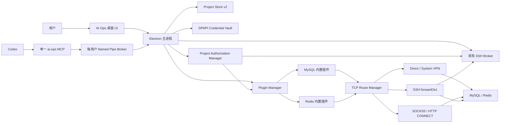
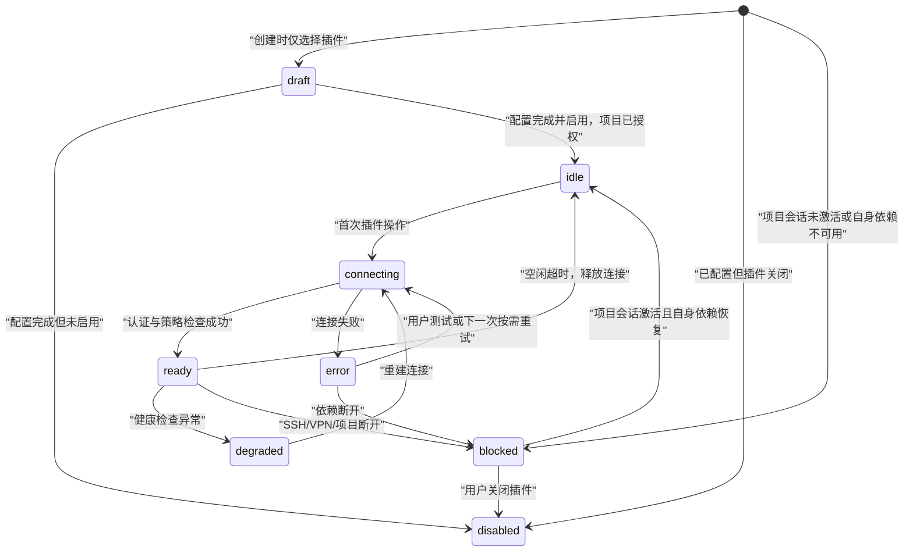

# AI 运维工具：插件化数据库与统一连接详细方案

> 状态：Proposed  
> 目标版本：RunbookBridge 0.4.x  
> 编写日期：2026-08-14  
> 适用范围：Windows Electron 桌面端、现有 SSH Broker、Codex MCP、MySQL 与 Redis 第一版

## 1. 结论

采用“**SSH 为主线、数据库为项目可选插件、网络路由由宿主统一管理、MCP 只暴露已授权能力**”的方案。

核心决策如下：

1. 项目的主要入口仍然是服务器 SSH；界面提供一个“开始/结束项目会话”的总授权开关，内部将项目授权状态与 SSH 网络状态分开管理。
2. MySQL、Redis 是内置能力插件。创建项目时可以选择，也可以稍后添加；同一项目可创建多个插件实例。
3. 每个插件实例独立选择访问方式：复用项目 SSH、直连、SOCKS5、HTTP CONNECT 或已有 Windows VPN。
4. 插件不能自行实现 SSH、代理、VPN或凭据保存；这些由宿主的统一路由层和凭据库提供。
5. Codex 继续只连接一个 `ai-ops` MCP。`open_project` 返回当前项目已配置的插件、状态和能力，后续使用类型化的 MySQL/Redis 工具。
6. 第一版只做数据库只读诊断，不做完整数据库 IDE，不嵌入 Tabularis/DBX 桌面界面，也不为每个数据库启动独立进程。
7. 第一版插件是随应用发布的可信内置插件，不开放任意第三方 JavaScript 插件加载。外部插件机制等基础能力稳定后再设计为隔离子进程。

这个方案直接解决当前痛点：只开一个 AI 运维工具；服务器、数据库和代理/VPN 配置在同一个项目内；多个数据库共享一条 SSH 会话；空闲时不维持大量数据库连接；Codex 能看到并使用项目明确启用的能力。

## 2. 产品定位与边界

### 2.1 产品定位

产品不是“另一个数据库客户端”，而是一个以项目为边界的本地 AI 运维控制面：

```text
项目文档 + 人工开启的项目授权会话 + 主要 SSH + 可选资源插件 + 本地安全 Broker + 单一 MCP
```

典型目标体验：

> 用户连接“订单系统生产”项目后，对 Codex 说“检查最近错误日志，再看订单库中这个订单的状态和 Redis 缓存是否一致”。Codex 读取项目文档和插件清单，通过同一个项目令牌查询日志、MySQL 和 Redis；用户断开项目后，全部能力立即失效。

### 2.2 第一版目标

- 一个项目始终以一个主要 SSH 服务器为核心；
- 创建项目时可勾选 MySQL、Redis；
- 一个项目可以有多个 MySQL/Redis 实例；
- 数据库可经当前 SSH、直连、SOCKS5、HTTP CONNECT 或系统 VPN 访问；
- 复用现有 SSH 登录、主机指纹、代理、自动重连、Named Pipe、审计和 `contextToken`；
- MySQL 提供结构、只读查询和执行计划；
- Redis 提供受限的键扫描、类型识别、值读取和 TTL；
- MCP 能看到插件元数据、连接状态、路由类型、只读策略和可用能力；
- 所有结果均有时间、行数和字节上限；
- 20 个已配置数据源在空闲时不产生 20 个常驻进程或连接池。

### 2.3 第一版明确不做

- 不嵌入 Tabularis、DBX 或其他完整数据库桌面 UI；
- 不再启动第二套 AI 聊天或第二套 MCP；
- 不提供任意 SQL 写入、DDL、Redis 任意命令、Lua、`MONITOR`；
- 不提供完整 SQL 编辑器、ER 图、数据批量编辑、导入导出；
- 不支持 Redis Cluster、Sentinel 的完整拓扑管理；
- 不开发自己的 VPN 协议或 TUN 驱动，只检测和使用 Windows 已建立的 VPN；
- 不开放任意第三方插件安装；
- 不允许 MCP 创建新的项目、SSH 登录或数据库凭据；
- 不把密码、连接串、私钥或查询结果写入项目 Markdown。

## 3. 核心概念

### 3.1 项目

项目仍是配置、文档、授权和审计的隔离边界。项目包含：

- 一个主要 SSH 连接；
- Markdown 运维文档；
- 命令策略和资源限制；
- 零到多个插件实例；
- 项目自己的加密凭据和审计记录。

### 3.2 插件类型与插件实例

必须区分二者：

- **插件类型**：随程序安装的代码，例如 `mysql`、`redis`；
- **插件实例**：某个项目中的具体配置，例如 `orders-mysql`、`cache-redis`。

一个项目可以同时存在：

```text
mysql/orders-main
mysql/reporting-readonly
redis/session-cache
redis/rate-limit-cache
```

所有 MCP 调用都必须带 `instanceId`，避免 AI 在多个生产数据库之间误选目标。

### 3.3 路由

路由只描述“本机如何到达目标 TCP 服务”，与数据库驱动分离。第一版支持：

- `project-ssh`：复用项目已经认证的 SSH 会话，通过 `forwardOut` 从服务器侧访问目标；
- `direct`：本机直接访问目标；
- `socks5`：经 SOCKS5 代理访问目标；
- `http-connect`：经 HTTP CONNECT 代理访问目标；
- `system-vpn`：使用已经连接的 Windows VPN 网卡，网卡缺失时拒绝连接。

项目 SSH 本身已经可以经 direct/SOCKS5/HTTP 建立，因此天然支持组合链路：

```text
SOCKS5 或 HTTP → SSH → MySQL/Redis
Windows VPN → SSH → MySQL/Redis
```

### 3.4 项目授权会话、SSH 会话与插件会话

授权不能继续硬编码为“存在 SSH session 才有 contextToken”。否则直连/VPN 云数据库会被错误依赖 SSH，插件配置变化也没有独立的撤权代次。新版增加 `ProjectAuthorizationManager`：

- 用户点击“开始项目会话”后产生独立的 project authorization generation；
- 同一动作会尝试连接主要 SSH，但项目授权与 SSH 网络状态是两个状态；
- SSH 工具额外校验 SSH session generation；
- `project-ssh` 数据库插件同时校验项目授权、插件 generation 和 SSH generation；
- direct/SOCKS5/HTTP/VPN 插件校验项目授权、插件安全 binding 和对应 dependency generation，不依赖 SSH 在线；
- 项目内启用给 AI 的插件变为“已授权、等待使用”，但不立即建立数据库连接；
- 首次插件操作时按需建立插件会话；
- 插件空闲超时后关闭连接，但本次项目授权仍保留；
- SSH 意外断线只阻塞 SSH 及其下游插件，不影响已经授权的直连/VPN 插件；
- 用户点击“结束项目会话”或退出应用时，SSH、全部插件、临时隧道和令牌一起撤销。

这样既保留一个明确的总开关，也让少量其他云厂商数据库在 SSH 故障时仍可独立使用。界面依然把主要服务器放在最显眼位置，技术上不再把所有资源硬绑在 SSH 上。

## 4. 总体架构



设计原则：

- UI 不持有数据库密码；
- MCP 不持有数据库密码；
- 插件不直接读取项目文件和其他插件的凭据；
- 网络能力只从 Route Manager 获得；
- 所有操作从 Plugin Manager 统一做授权、限流和审计；
- 断开依赖时由宿主统一回收下游资源。

## 5. 用户流程

### 5.1 创建项目

创建流程保持简洁，最多两步：

1. **服务器**：项目名称、SSH 地址、端口、用户、认证方式、SSH 自身使用的代理；
2. **可选能力**：勾选 MySQL、Redis，可以立即配置，也可以只勾选后稍后完善。

插件卡片字段示例：

```text
[✓] MySQL
名称：订单主库
地址：127.0.0.1:3306
数据库：orders
访问方式：复用当前项目 SSH
账号：aiops_readonly
[✓] 记住凭据（Windows 加密）

[✓] Redis
名称：订单缓存
地址：127.0.0.1:6379
DB：0
访问方式：复用当前项目 SSH
ACL 用户：aiops_readonly
```

选择“复用当前项目 SSH”时：

- MySQL 默认建议 `127.0.0.1:3306`；
- Redis 默认建议 `127.0.0.1:6379`；
- 也允许填写 SSH 服务器能够访问的内网 DNS/IP，例如云厂商内网数据库地址。

### 5.2 连接与使用

1. 用户点击“开始项目会话”；
2. 工具创建项目授权会话，同时建立 SSH 并校验服务器指纹；
3. 若 SSH 失败，SSH 和 `project-ssh` 插件显示阻塞，但 direct/VPN/代理插件仍可按授权状态使用；
4. 插件卡片显示“已授权，等待使用”；
5. Codex 调用 `open_project`，取得文档、插件清单和新的 `contextToken`；
6. Codex 调用某个插件工具；
7. Plugin Manager 首次按需建立路由和数据库会话；
8. 操作完成后保留短时空闲连接，超时即关闭；
9. 用户点击“结束项目会话”，SSH、数据库池、临时隧道、游标和令牌全部失效。

### 5.3 分层连接诊断

“测试连接”不能只显示“连接失败”，应按链路输出：

```text
1. VPN/代理状态       成功
2. SSH 会话           成功
3. SSH → 目标 TCP     成功，18 ms
4. MySQL/Redis 认证    成功
5. 只读权限检查       成功/警告
6. TLS 与证书          成功/不适用
```

错误必须定位到具体层，避免用户在数据库密码、VPN、SSH 和目标监听地址之间反复猜测。

## 6. 项目配置 v2

### 6.1 配置示例

第一版保留“一个主要 SSH”的产品模型，但把现有 `proxy` 规范化为可复用 `routes`，再新增 `plugins`。这样多个数据库可以引用同一个 VPN/代理配置，密码仍不进入 YAML。

```yaml
version: 2
id: order-prod
name: 订单系统生产环境

ssh:
  ref: primary
  host: 203.0.113.10
  port: 22
  username: order-deploy
  routeRef: ssh-uplink
  hostKeyFingerprint: SHA256:example

auth:
  type: privateKey
  privateKeyPath: C:\Users\me\.ssh\id_ed25519
  credentialRef: ssh/primary

credentials:
  remember: true

routes:
  ssh-uplink:
    type: socks5
    host: 127.0.0.1
    port: 10808
    username: ""
    remoteDns: true
    credentialRef: route/ssh-uplink

  project-ssh:
    type: ssh-forward
    sshRef: primary

  corp-vpn:
    type: system-vpn
    guard:
      interfaceGuid: "{vpn-adapter-guid}"
      displayName: Corp VPN
      expectedSourceCidrs: ["10.20.0.0/16"]
      failClosed: true

commandPolicy:
  enabled: true
  customDeny: []

limits:
  commandTimeoutSeconds: 180
  maxUploadMB: 500
  maxDownloadMB: 100
  maxDocumentKB: 200
  maxLogScanMB: 16

plugins:
  - instanceId: orders-mysql
    pluginId: mysql
    configVersion: 1
    configState: configured
    displayName: 订单主库
    enabled: true
    aiAccess: true
    endpoint:
      host: 127.0.0.1
      port: 3306
      database: orders
    routeRef: project-ssh
    auth:
      username: aiops_readonly
      credentialRef: plugin/orders-mysql
    tls:
      mode: disabled
    policy:
      mode: read-only
      allowedDatabases: [orders]
      allowedTables: []
      timeoutMs: 10000
      maxRows: 100
      maxBytes: 1048576
      maxConcurrent: 1

  - instanceId: shared-redis
    pluginId: redis
    configVersion: 1
    configState: configured
    displayName: 共享缓存
    enabled: true
    aiAccess: true
    endpoint:
      host: redis.vendor.internal
      port: 6380
      database: 0
    routeRef: corp-vpn
    auth:
      username: aiops_readonly
      credentialRef: plugin/shared-redis
    tls:
      mode: verify-full
      serverName: redis.vendor.internal
    policy:
      mode: read-only
      allowedKeyPatterns: ["order:*", "session:*"]
      timeoutMs: 5000
      maxItems: 100
      maxBytes: 524288
      maxConcurrent: 1
```

### 6.2 配置规则

- `instanceId` 在项目内唯一，创建后不可静默改变；
- `configState=configured` 时必须通过完整 endpoint/route/auth/policy 校验，才允许 `enabled=true` 或 `aiAccess=true`；
- 创建向导允许保存最小化 `configState=draft` 实例，但 draft 必须 `enabled=false`、`aiAccess=false`，不能包含凭据、不能建立连接、不能签发 grant；
- draft 只允许 `instanceId/pluginId/configVersion/displayName/configState/enabled/aiAccess`，完成配置时再一次性转为 configured；
- route ID 在项目内唯一，`routeRef` 必须指向已存在路由；多个插件可以复用同一个 route；
- `ssh.routeRef` 不能引用 `ssh-forward`，`ssh-forward.sshRef` 第一版只能引用 `primary`，防止循环依赖；
- `ssh-forward` 下的 endpoint 从远端 SSH 服务器视角解析，其他 route 从本机或代理视角解析；
- route 不允许自动 fallback；`system-vpn.guard.failClosed` 必须为 true；
- VPN 适配器以稳定 GUID 为配置身份，display name 只用于展示；目标解析后的最佳路由必须命中该接口及允许的源地址网段；
- `pluginId + configVersion` 决定由谁验证和迁移配置；
- `credentialRef` 只是引用，不包含用户名之外的秘密；
- `enabled=false` 表示插件配置保留但完全不可用；
- `aiAccess=false` 表示桌面端可以测试，MCP 不可调用；
- routeRef、route 安全配置、endpoint、用户名、TLS 身份发生变化时，该凭据条目的绑定失效并要求重新确认；
- YAML 中出现密码、token、privateKeyPassphrase、proxyPassword 等秘密字段时直接拒绝保存，不能静默忽略；
- 未知字段默认报错，避免拼写错误被悄悄丢弃；
- 配置写入继续使用临时文件 + 原子重命名；
- 项目级文档/命令策略/全局限制变化使整个 `contextToken` 失效；单个插件或 route 变化只改变对应 grant 的 binding/dependency generation，不误撤销其他独立插件 grant。

## 7. 内置插件框架

### 7.1 为什么第一版只做内置插件

数据库插件运行在持有网络和凭据能力的进程中。直接加载任意第三方 JavaScript 等价于给插件读取本机文件、内存和全部环境变量的能力，无法靠普通接口约定形成安全隔离。因此：

- 0.4.x 只注册随安装包发布并经过测试的 MySQL/Redis 插件；
- 插件版本与桌面端、MCP 一起发布和签名；
- 暂不做插件市场、动态 npm 安装和热加载。

未来外部插件必须运行在隔离子进程中，通过受限 JSON-RPC/stdio 与宿主通信，并拥有明确的网络、凭据字段和操作权限清单。

### 7.2 插件目录

```text
apps/ai-ops/src/plugins/
├─ contracts.mjs
├─ registry.mjs
├─ plugin-manager.mjs
├─ mysql/
│  ├─ manifest.mjs
│  ├─ config.mjs
│  ├─ adapter.mjs
│  ├─ policy.mjs
│  └─ result-normalizer.mjs
└─ redis/
   ├─ manifest.mjs
   ├─ config.mjs
   ├─ adapter.mjs
   ├─ policy.mjs
   └─ result-normalizer.mjs
```

### 7.3 插件清单契约

```js
export const manifest = {
  apiVersion: 1,
  pluginId: 'mysql',
  displayName: 'MySQL',
  configVersion: 1,
  supportedRouteTypes: ['ssh-forward', 'direct', 'socks5', 'http-connect', 'system-vpn'],
  capabilities: [
    'db.metadata.read',
    'db.query.read',
    'db.explain.read',
  ],
  credentialFields: ['username', 'password'],
};
```

### 7.4 插件定义与会话契约

```js
export const pluginDefinition = {
  apiVersion: 1,
  manifest,
  normalizeConfig(rawConfig, validationContext),
  securityProjection(normalizedConfig, resolvedRoute),
  credentialBinding(normalizedConfig, resolvedRoute),
  describeForMcp(normalizedConfig, runtimeStatus),
  async createSession(sessionContext) {
    return {
      ping(),
      invoke(operation, input, invokeContext),
      close(reason),
    };
  },
};
```

- `normalizeConfig` 严格校验并拒绝未知字段；
- `securityProjection` 返回参与项目安全 hash/context grant 的非秘密字段；
- `credentialBinding` 返回 endpoint、route、username、TLS 身份等凭据绑定字段；
- `describeForMcp` 只能返回公开元数据；
- `createSession` 只取得当前实例需要的目标连接、当前实例凭据、policy 和 AbortSignal。

`hostServices` 只提供受限服务：

```text
transport.acquireConfiguredTarget()  # 已绑定当前 routeRef 与 endpoint，插件不能改 host/port
sessionContext.credentials            # 宿主仅注入当前实例已完成 binding 校验的凭据
sessionContext.policy / abortSignal
clock
```

超时、并发、结果字节上限、operationId 和审计由 Plugin Manager 包裹 `invoke` 统一执行，不能依赖插件自觉调用。

插件不直接获得：

- Electron `safeStorage`；
- ProjectStore 文件路径；
- 其他插件配置或凭据；
- Named Pipe token；
- 未经过路由白名单的任意 socket；
- 任意 MCP 工具注册权限。

### 7.5 插件注册与工具发现

MCP 工具列表在进程启动时是稳定的，不能随着用户切换项目频繁变化。因此：

- 安装包内存在 MySQL 插件时，MySQL 工具始终可被 MCP 发现；
- 调用时再检查目标项目是否配置并启用了该 `instanceId`；
- 未配置返回 `PLUGIN_NOT_CONFIGURED`；
- 未授权给 AI 返回 `PLUGIN_AI_ACCESS_DISABLED`；
- 路由不可用返回 `ROUTE_UNAVAILABLE`；
- 不使用一个接收任意 `operation` 和任意参数的通用 `plugin_call` 工具。

类型化工具虽然数量略多，但参数清晰、权限边界更容易审计，也能减少 AI 生成错误调用。

## 8. 统一 TCP 路由层

### 8.1 核心接口

```js
await routeManager.dial({
  projectId,
  instanceId,
  routeRef,
  target: { host, port },
  timeoutMs,
  signal,
});

// 返回
{
  stream,             // Node Duplex
  routeRef,
  routeType,
  routeGeneration,
  bindingHash,
  close,
}
```

对于只能接受普通 host/port 的驱动，提供临时回环隧道：

```js
const lease = await routeManager.leaseTcpEndpoint(...);
// { host: '127.0.0.1', port: randomPort, generation, close }
```

回环端口要求：

- 只绑定 `127.0.0.1`；
- 使用系统随机端口；
- 不写入配置；
- 限制并发连接数和空闲时间；
- 接受目标驱动需要的连接后立即关闭 listener，底层 socket 由该 lease 独占；
- MySQL/Redis 驱动自行重连必须关闭；底层连接断开后由 Plugin Manager 重新验证 dependency generation、创建新 lease 并重建 database session；
- 插件关闭、项目授权结束、对应路由依赖断开或路由代次变化时立即关闭；
- 不作为用户可长期连接的通用端口转发功能。

### 8.2 `project-ssh`

在现有 `SshBroker` 中新增受控方法，取得已认证会话后调用：

```js
client.forwardOut(
  '127.0.0.1',
  0,
  target.host,
  target.port,
  callback,
);
```

约束：

- MCP 不能传入任意 target；target 必须来自当前插件的已保存配置；
- 必须检查项目 SSH 已连接且 session generation 与令牌一致；
- 每项目限制同时打开的 forward channel 数；
- SSH close/error 时销毁所有依赖的 channel、数据库池和分页游标；
- 自动重连产生新 generation，旧插件池不可复用。

### 8.3 `direct`

- 使用 `net.connect`/`tls.connect`；
- DNS、TCP、TLS、认证分别设置超时；
- 目标只取自插件配置，不允许 MCP 临时指定任意主机；
- 默认不允许链路自动降级到其他 route。

### 8.4 SOCKS5 与 HTTP CONNECT

复用现有 `proxy.mjs` 的通用 `createProxySocket(proxy, target, ...)` 能力，并将其移入 Route Manager 管理生命周期。代理账号密码仍从 Credential Vault 读取。

若项目 SSH 自身已经通过代理连接，数据库选择 `project-ssh` 时无需再配置数据库代理，链路自然是“代理 → SSH → 数据库”。

### 8.5 `system-vpn`

第一版不负责拨号，只使用用户已经建立的 Windows VPN。连接前必须：

1. 检查配置的适配器存在且状态可用；
2. 通过稳定 interface GUID 解析当前 ifIndex 和允许的 IPv4/IPv6 源地址，不能只匹配易变化的 display name；
3. 对目标 DNS 解析出的每个地址查询 Windows 最佳路由，确认 outgoing interface 正是预期 VPN；仅绑定 `localAddress` 不视为充分证明；
4. socket 使用验证过的本地地址建立连接；
5. 监听或定期核对接口、地址和路由表变化，变化时增加该 route 的 dependency generation 并关闭全部下游连接；
6. 拒绝自动回退为普通公网直连。

最佳路由检查可通过 Windows IP Helper API 的受控 helper，或经过严格参数化的 PowerShell 网络探针实现；阶段 0 必须选定一种并做真实 VPN smoke test，不能只 mock `os.networkInterfaces()`。

这是一条 fail-closed 规则。若无法确认 VPN 状态，应返回 `VPN_REQUIRED`，而不是尝试“也许能通”的普通直连。

## 9. 连接生命周期与状态机

### 9.1 插件状态

| 状态 | 含义 |
| --- | --- |
| `draft` | 用户已选择插件类型但尚未完成配置，不可连接或授权给 AI |
| `disabled` | 配置保留，但用户关闭插件 |
| `idle` | 已配置且项目已授权，当前无数据库连接 |
| `blocked` | 项目授权会话未激活、AI 权限关闭，或该实例自己的 SSH/VPN/代理依赖不可用 |
| `connecting` | 正在建立路由、TLS 和数据库认证 |
| `ready` | 有可用连接，可执行操作 |
| `degraded` | 连接存在但健康检查或部分能力异常 |
| `error` | 最近一次建立或执行失败，等待显式重试/下一次按需连接 |

### 9.2 状态转换



### 9.3 资源限制默认值

- 第一版每插件实例只保留 1 条底层数据库连接，MySQL/Redis 操作默认串行；
- 每实例等待队列最多 10 个请求，超过返回 `PLUGIN_BUSY`；框架保留未来小连接池扩展点；
- 首次连接超时：5 秒；
- 默认查询超时：MySQL 10 秒，Redis 5 秒；
- 默认空闲回收：60 秒；
- 默认最大返回：100 行/项；
- 单次结果最大：MySQL 1 MiB，Redis 512 KiB；
- 单项目同时打开的 SSH forward channel 设置硬上限；
- 全局设置总连接和总查询并发上限，避免多个项目一起拖慢桌面端。

## 10. MySQL 插件

### 10.1 技术选型

使用 `mysql2`：控制类调用可使用 Promise API，返回行的查询必须使用流式消费路径。它没有必需的原生绑定，支持预处理参数、TLS、自定义 stream 和未来连接池扩展，适合当前 Electron/Node 打包方式。第一版每实例使用单连接和串行队列，具体版本在实现时固定并记录完整 lockfile，不自动追踪 latest。

### 10.2 MCP 能力

```text
mysql_list_databases
mysql_list_tables
mysql_describe_table
mysql_query_readonly
mysql_explain
```

所有工具参数都包括：

```text
projectId
contextToken
instanceId
```

`mysql_query_readonly` 额外接受 SQL 和可选参数数组，禁止把字符串拼接作为推荐用法。返回：

- SQL 最大 32 KiB；
- 参数最多 100 个，只允许 null/string/number/boolean；
- 请求的 `maxRows/timeout` 与插件 policy、宿主硬上限取最小值；
- CTE 只有在最终语句是允许的只读 SELECT 且 AST 全部可验证时才允许。

返回：

```json
{
  "operationId": "...",
  "instanceId": "orders-mysql",
  "columns": [{ "name": "id", "type": "BIGINT" }],
  "rows": [],
  "rowCount": 0,
  "truncated": false,
  "bytes": 0,
  "durationMs": 12
}
```

### 10.3 只读策略

只读不能只靠 SQL 正则。必须采用多层防护：

1. 数据库端使用专用只读账号，只授予必要 schema/table 的 `SELECT`；
2. 驱动关闭 multi-statements；
3. 宿主只接受单条语句；
4. 使用 MySQL 语法解析器/AST 做 fail-closed 分类；解析失败直接拒绝；
5. 只允许 `SELECT`、`SHOW`、`DESCRIBE`、受限 `EXPLAIN`，明确禁止会实际执行查询的 `EXPLAIN ANALYZE`；
6. 拒绝 `FOR UPDATE`、`LOCK IN SHARE MODE`、`INTO OUTFILE`、`INTO DUMPFILE`、`LOAD_FILE()`、`SLEEP()`、`BENCHMARK()`、用户变量写入、存储过程和其他具有副作用、拒绝服务或越权读取风险的构造；
7. 应用 database/table allowlist；
8. 设置服务端可用的执行时间限制，并在客户端超时后销毁该连接，不把未知状态连接放回池；
9. 限制行数、字节数和并发；
10. 审计保存 SQL 归一化指纹和 hash，不保存参数值与返回数据。

即使策略层判断为只读，UI 仍应提示：真正的安全边界是数据库账号权限，生产环境不能使用 root 或拥有 FILE/DDL/DML 权限的账号。连接测试应读取并分析当前账号可见的 grants；若无法确认最小权限则给出持续警告，而不能标记为“已验证只读”。

结果规范化也属于安全和正确性要求：BIGINT、DECIMAL 以字符串返回，日期不按本机时区静默转换，二进制字段返回带编码和字节数的描述对象，不能把驱动 Buffer 或内部对象直接传给 MCP。

### 10.4 读取阶段限额

结果上限必须在数据库协议读取阶段生效，不能先让 Promise API 把完整结果集装入内存再截断：

- AST 在不改变语义的前提下给顶层结果增加 `hardMaxRows + 1`，已有更大 LIMIT 时向下收紧；无法安全重写则拒绝；
- 使用 mysql2 的流式 row 消费路径，逐行规范化并累计字节；达到行数或字节上限立即停止读取、销毁该连接且不放回会话；
- 单个超大 BLOB/LONGTEXT 仍可能在一行解码时占用较多内存，因此默认拒绝直接预览大对象列；只允许显式使用受限长度表达式并返回原始长度；
- schema/table/index 元数据也必须分页并受字节上限约束；
- `rows` 数组只包含已经通过预算检查的内容，超大对象永远不进入 renderer/MCP 序列化。

### 10.5 元数据缓存

- `list_tables`、`describe_table` 可以缓存 60 秒；
- 缓存 key 绑定插件配置 hash、dependency generation 和 database session generation；
- `open_project` 不自动抓取完整 schema；
- 只有 AI 明确调用元数据工具时才访问数据库；
- 返回列数、表数和总字节有上限，超出时分页或截断。

### 10.6 第一版兼容范围

- MySQL 单实例或兼容 MySQL 协议的服务；
- 用户名/密码认证；
- 可选 TLS CA、客户端证书和 server name 校验；
- 不承诺所有厂商专有认证插件；
- 不做写操作、存储过程执行、LOAD DATA、binlog、管理账号；
- 通过兼容性矩阵记录实际验证过的 MySQL 大版本和云厂商。

## 11. Redis 插件

### 11.1 技术选型

使用官方 `node-redis` 基础客户端。通过 Route Manager 的回环 lease 连接 SSH、SOCKS/HTTP 或 VPN 链路，避免把各类网络实现耦合到 Redis 驱动。具体主版本需在实现 spike 中固定，并对升级进行兼容测试。

### 11.2 MCP 能力

```text
redis_scan
redis_read
redis_ttl
```

不暴露 `redis_command`。`redis_read` 根据类型使用受限操作：

- string：`GET`，限制最大字节；
- hash：`HSCAN` 分页，不默认 `HGETALL`；
- list：有界 `LRANGE`；
- set：`SSCAN`；
- sorted set：有界 `ZRANGE`；
- 其他类型第一版返回类型和“不支持预览”，不尝试任意命令。

### 11.3 安全策略

- 使用 Redis ACL 只读用户；
- ACL 限制允许命令与 key pattern；
- 插件配置再限制 `allowedKeyPatterns`；
- 禁止 `KEYS`、`EVAL/EVALSHA`、`MONITOR`、`CONFIG`、`MODULE`、`SCRIPT`、`FLUSH*`、`MIGRATE` 等；
- `SCAN` 限制循环次数、总耗时和总 key 数；
- `redis_scan` 返回短期不透明游标，绑定 projectId、instanceId、允许的 pattern、dependency generation、database session generation 和过期时间；
- MCP 传入的 pattern 第一版只能省略或与配置中的某个 `allowedKeyPatterns` 完全相同，不尝试做容易出错的 glob 子集判断；
- key 在审计中只保存 hash 或经策略允许的脱敏前缀；
- 值不进入审计；
- 大 value 只返回前 N 字节并明确 `truncated`；
- string 先读取 `STRLEN`，再用 `GETRANGE 0..N-1` 获取有界内容，禁止先执行完整 `GET` 后截断；
- hash/list/set/zset/stream 只使用有界分页命令，达到预算立即停止下一页；
- node-redis 的驱动自动重连必须关闭；连接中断后由 Plugin Manager 创建新的 route lease 和 database session，禁止客户端反复重连已关闭的临时回环端口；
- 插件不自动启用客户端缓存，避免把生产数据长期留在桌面进程内存。

### 11.4 第一版兼容范围

- standalone Redis；
- ACL 用户名/密码或单密码认证；
- 可选 TLS；
- 选择逻辑 DB；
- Redis Cluster、Sentinel、集群节点地址重写和代理拓扑放到后续版本。

## 12. MCP 设计

### 12.1 `list_projects`

在现有返回中增加轻量摘要，不访问数据库：

```json
{
  "id": "order-prod",
  "name": "订单系统生产环境",
  "projectSession": { "active": true },
  "ssh": { "connected": false, "generation": null },
  "pluginSummary": {
    "configured": 3,
    "aiEnabled": 2,
    "types": ["mysql", "redis"]
  }
}
```

### 12.2 `open_project`

返回文档和插件公开信息，但不返回密码、完整 DSN、代理凭据或 TLS 私钥：

```json
{
  "projectId": "order-prod",
  "projectSession": { "active": true, "generation": 4 },
  "ssh": { "connected": true, "generation": 8 },
  "contextToken": "...",
  "plugins": [
    {
      "instanceId": "orders-mysql",
      "pluginId": "mysql",
      "displayName": "订单主库",
      "configState": "configured",
      "enabled": true,
      "aiAccess": true,
      "state": "idle",
      "grantAvailable": true,
      "route": "project-ssh",
      "targetSummary": "127.0.0.1:3306/orders",
      "policy": "read-only",
      "capabilities": [
        "db.metadata.read",
        "db.query.read",
        "db.explain.read"
      ]
    }
  ]
}
```

`open_project` 只读取本地配置和运行时状态，不建立数据库连接，不扫描 schema。

`projectSession.active` 与 `ssh.connected` 是两个独立字段。为兼容旧显示若短期保留顶层 `connected`，它只能明确作为 `ssh.connected` 的废弃别名；所有新版授权和插件逻辑必须使用新字段。

draft 插件可以作为“尚未配置完成”的提示返回，但必须 `grantAvailable=false`、capabilities 为空且不包含 endpoint/credential 状态；MCP 调用它统一返回 `PLUGIN_CONFIG_INCOMPLETE`。

桌面程序未运行时仍可返回静态插件配置，但 `state` 必须是 `desktop-unavailable`、`contextToken` 为 null；不能把“已配置”伪装为“已连接”。

### 12.3 `contextToken` 扩展

现有令牌把可操作上下文整体绑定到 SSH session generation。新版改为“项目授权 + 资源 grant”，并严格区分三类代次：

1. `projectAuthorizationGeneration`：用户开始/结束项目会话时变化；文档 hash、项目级安全策略、MCP client instance 和过期时间也属于整个 token 的绑定；
2. `dependencyGeneration`：某个 grant 依赖的 SSH、VPN guard 或 route 安全配置代次，只撤销该 grant；
3. `databaseSessionGeneration`：数据库实际连接、schema cache 和分页游标的生命周期，不进入授权 token。空闲回收和按需重连不会让授权令牌无故失效。

每个插件 grant 的 `bindingHash` 覆盖 instanceId/pluginId/configVersion、configured/enabled/aiAccess、endpoint、route 安全投影、username、TLS 身份、credential revision、policy 和 capability scope。

令牌内部为每个资源保存独立 grant：

```js
{
  projectAuthorizationGeneration,
  sshGrant: { generation, capabilities },
  pluginGrants: {
    'orders-mysql': {
      pluginId: 'mysql',
      bindingHash: 'sha256:...',
      dependencyGeneration: 8,
      capabilities: ['db.metadata.read', 'db.query.read'],
      sshGeneration: 8
    },
    'shared-redis': {
      pluginId: 'redis',
      bindingHash: 'sha256:...',
      dependencyGeneration: 3,
      capabilities: ['redis.scan', 'redis.read'],
      sshGeneration: null
    }
  }
}
```

验证 SSH 操作时检查 `sshGrant`；验证插件操作时只检查对应 `pluginGrant`。

- 用户结束项目会话、项目文档或项目级安全配置变化：整个 token 失效；
- 插件新增：旧 token 没有它的 grant，因此不能访问；
- 插件删除、禁用、aiAccess 关闭，或 endpoint/route/账号/TLS/credential revision/policy 变化：只撤销该插件 grant；
- SSH 自动重连：只撤销 `sshGrant` 和引用该 SSH 的插件 grant；
- VPN guard 的接口/最佳路由发生变化：只撤销引用该 route 的插件 grant；
- 数据库连接空闲关闭、查询超时后重建：只增加 database session generation，不撤销授权 grant。

`open_project` 时 SSH 未连接，不签发 `sshGrant` 和 `project-ssh` 插件 grant；SSH 随后连上后，Codex 必须重新 `open_project` 才能取得这些能力。Broker 对失效资源返回明确错误，其他独立 grant 仍可继续使用。

### 12.4 Broker 方法

新增的 Named Pipe dispatch 使用显式方法，不允许任意转发：

```text
openProjectContext
pluginStatuses
pluginTestConnection
pluginInvoke
```

`pluginInvoke` 只作为 Broker 内部统一入口；MCP 对每个公开工具使用硬编码的 `pluginId + operation` 映射，不能把 AI 提供的任意 operation 原样透传。

桌面 UI 的配置保存和凭据输入继续走 Electron IPC，不通过 MCP 暴露。

## 13. 凭据设计

### 13.1 通用 Credential Vault

当前 `CredentialStore` 只认识 SSH 密码、私钥口令和代理密码，并把全部秘密绑定到整个 SSH 配置。新版改为按条目管理：

```text
ssh/primary
route/corp-proxy
plugin/orders-mysql
plugin/shared-redis
tls/shared-redis-client-key
```

每个条目包含：

- `credentialRef`；
- `kind`；
- 非秘密 binding；
- 通过 Electron `safeStorage`/Windows DPAPI 加密的 payload；
- envelope version；
- 创建和更新时间；
- 不包含可供 MCP 读取的明文摘要。

binding 至少包括：

```text
projectId
plugin instanceId 或 route id
endpoint host/port
username/auth type
database identity
TLS server name/client cert identity
config revision
```

目标或身份改变后，旧凭据不能被静默复用。

### 13.2 安全边界

- Windows DPAPI 主要防止其他 Windows 用户读取本地密文；
- 同一 Windows 登录会话中的恶意进程不在其隔离能力内；
- 凭据解密只发生在 Electron 主进程；
- renderer、MCP、日志、错误 details、审计和 crash report 中不得出现秘密；
- 凭据对象使用后尽快解除引用，不能保证 JavaScript 内存可被可靠清零，因此要减少生命周期和复制次数；
- 未来可迁移到 Electron 异步 safeStorage API，避免主线程阻塞并支持密钥轮换语义。

## 14. 审计设计

继续写入项目 `audit/operations.jsonl`，将 schema 升级并保持逐行 JSON。数据库记录示例：

```json
{
  "schemaVersion": 3,
  "time": "2026-08-14T10:00:00.000Z",
  "operationId": "...",
  "clientInstanceId": "...",
  "projectId": "order-prod",
  "pluginId": "mysql",
  "instanceId": "orders-mysql",
  "operation": "query-readonly",
  "routeType": "ssh-forward",
  "routeGeneration": 8,
  "statementType": "SELECT",
  "queryFingerprint": "select ... where id = ?",
  "queryHash": "sha256:...",
  "result": "success",
  "durationMs": 18,
  "rowCount": 1,
  "responseBytes": 248,
  "truncated": false
}
```

不得记录：

- SQL 参数值；
- 完整 Redis key（默认只记录 hash）；
- 数据库返回行和值；
- 密码、token、私钥、完整连接串；
- TLS 私钥和代理认证头。

策略拒绝也要审计，但只保存规则 ID、语句类型、query hash 和公开错误码。数据库插件默认启用 `requireAudit: true`：执行前审计无法写入则拒绝操作；执行后审计失败则丢弃结果并返回明确错误，避免生产数据在没有审计记录时继续交给 MCP。现有 SSH 操作可暂时维持 `auditWarning` 兼容行为，后续再统一策略。

## 15. UI 方案

### 15.1 主页面结构

保持现有轻量页面，增加一个“连接与能力”区域：

```text
┌ 项目 ─────────┬ 订单系统生产环境 ──────────────────────┐
│ ● 订单生产    │ 项目会话  已激活        [结束会话]    │
│ ○ 用户中心    │ SSH  order@server       已连接 [断开] │
│               │ 路由  SOCKS5 → SSH                     │
│               ├───────────────────────────────────────┤
│               │ [运行手册] [连接与能力] [审计]        │
│               │                                       │
│               │ MySQL  订单主库                       │
│               │ SSH → 127.0.0.1:3306  已授权/空闲     │
│               │ [测试] [编辑] [暂停 AI]               │
│               │                                       │
│               │ Redis   共享缓存                      │
│               │ VPN → redis.vendor:6380  已授权/空闲  │
│               │ [测试] [编辑] [暂停 AI]               │
│ [+ 新建项目]  │                         [+ 添加插件]   │
└───────────────┴───────────────────────────────────────┘
```

### 15.2 插件配置页

共同字段：

- 插件类型、显示名称、实例 ID；
- host、port；
- 访问方式；
- 用户名与“记住凭据”；
- 启用/暂停 AI 使用；
- 只读策略与资源上限；
- 测试连接和分层诊断。

MySQL 额外字段：database、TLS、允许的库/表。  
Redis 额外字段：逻辑 DB、TLS、允许的 key pattern。

### 15.3 结果展示

桌面端只提供轻量预览：

- 结构树；
- 受限表格结果；
- Redis 类型和值摘要；
- 截断、耗时、行数、字节数提示；
- 复制已脱敏结果的能力。

不加入 Monaco、CodeMirror、完整 ER 图或海量 DOM 表格。表格必须虚拟化或严格限制为小结果；大结果不进入 renderer。

### 15.4 状态刷新

当前 renderer 每 5 秒全量刷新项目。插件增加后继续全量刷新会放大卡顿。新版应改为：

- 首次加载全量 snapshot；
- 主进程通过 IPC 推送连接、插件和路由状态变化；
- renderer 按 project/plugin key 做增量更新；
- 仅在事件丢失或用户手动刷新时重新取全量 snapshot；
- 编辑中的表单和 Markdown 不被状态事件重建。

## 16. 性能预算

为避免重现 Tabularis 卡顿，第一版设以下工程约束：

- 不运行额外数据库桌面进程或每连接一个 MCP 子进程；
- 插件按需连接，空闲自动释放；
- 20 个已配置但未使用的插件应为 0 个数据库 socket；
- `open_project` 不访问数据库，不加载完整 schema；
- 单次 MCP 结果默认最多 100 行/项并受字节上限控制；
- MySQL/Redis/元数据在协议读取阶段分页、限行和限字节，不先完整装入内存；
- 连接池、游标、schema cache 都绑定代次并有 TTL；
- UI 状态使用事件增量更新，不做固定 5 秒全量重建；
- renderer 中不长期保存生产查询历史和完整结果；
- 所有网络和查询 API 支持 timeout/AbortSignal；
- 测试覆盖反复连接/断开后的 handle、socket 和 listener 泄漏。

建议验收性能指标：

- 空闲 10 分钟无持续 CPU 活动；
- 配置 20 个插件但不调用时不建立数据库连接；
- 连续 100 次 SSH 断开/重连后，下游 route lease 数回到 0；
- 100 行、1 MiB 内结果不会造成 UI 明显冻结；
- 超出硬上限的读取在主进程立即停止并丢弃/销毁不再可信的连接，不把超大对象传到 renderer/MCP。

## 17. 对现有代码的改造映射

### 17.1 保留并扩展

- `src/project-store.mjs`：支持 v1/v2、插件配置验证、插件安全 hash；
- `src/ssh-broker.mjs`：增加受控 `forwardOut`、依赖关闭事件和 channel 上限；
- `src/proxy.mjs`：抽到通用 Route Manager，继续复用 SOCKS5/HTTP；
- `src/connection-manager.mjs`：只管理 SSH 连接，并把会话代次事件交给 Project Runtime；
- `src/broker-server.mjs`：增加显式插件方法；
- `src/mcp.mjs`：扩展 `list_projects/open_project`，加入类型化工具；
- `src/preload.cjs`：加入插件配置、测试和状态订阅 IPC；
- `renderer/app.js`：插件卡片、配置表单和事件增量刷新；
- `audit/operations.jsonl`：支持数据库审计 schema。

### 17.2 新增模块

```text
src/project-authorization-manager.mjs
src/project-runtime-manager.mjs
src/credential-vault.mjs
src/plugin-manager.mjs
src/plugins/contracts.mjs
src/plugins/registry.mjs
src/plugins/mysql/*
src/plugins/redis/*
src/routes/tcp-route-manager.mjs
src/routes/direct-route.mjs
src/routes/proxy-route.mjs
src/routes/system-vpn-route.mjs
src/routes/ssh-forward-route.mjs
src/routes/tunnel-lease-manager.mjs
src/plugin-policy.mjs
src/plugin-errors.mjs
```

### 17.3 依赖变化

第一版预期新增：

- `mysql2`；
- `redis` 或只使用 `@redis/client`；
- 一个经过兼容与安全测试的 MySQL SQL AST 解析器。

优先选择纯 JavaScript/TypeScript 依赖，避免改变当前 `npmRebuild:false` 和 Electron 打包约束。引入前必须检查许可证、维护状态、供应链和打包体积，并在 lockfile 中固定版本。

## 18. 配置与凭据迁移

### 18.1 `project.yaml` v1 → v2

迁移原则：

1. 新版仍能读取 v1；
2. 内存中把 v1 规范化为“无插件的 v2”：原 direct/SOCKS5/HTTP proxy 映射为 `routes.ssh-uplink`，SSH 增加 `routeRef: ssh-uplink`，并自动加入 `routes.project-ssh`；
3. 只有用户保存项目或添加插件时才写 v2；
4. 写入前生成一次 `project.yaml.v1.bak`；
5. 使用临时文件、fsync/rename 和回读校验；
6. 迁移失败保留原 v1，不产生半配置；
7. 新版提示旧版应用不能编辑 v2 项目。

### 18.2 凭据 v2 → 通用 Vault

1. 首次连接时读取旧 `credentials.enc.json`；
2. 验证旧 binding 并成功解密；
3. 写入并回读验证新的 `ssh/primary` 条目；
4. 新旧文件短期并存，直到新格式验证成功；
5. 删除旧文件前保留可恢复备份或明确升级完成标记；
6. 数据库凭据始终作为独立条目新增，不改变 SSH 凭据绑定。

### 18.3 MCP 与桌面版本

现有 MCP 与桌面端要求版本一致。新增工具后继续保持严格版本检查：

- 同一安装包发布 desktop/MCP；
- 升级后提示完全重启 Codex；
- 版本不一致时仍可读取本地项目和文档，但不签发操作令牌；
- 不允许旧 MCP 调用新插件 Broker 方法。

## 19. 错误码

| 错误码 | 含义 | 用户处理 |
| --- | --- | --- |
| `PLUGIN_NOT_CONFIGURED` | 项目没有该实例 | 在桌面端添加或选择正确实例 |
| `PLUGIN_DISABLED` | 插件被关闭 | 在桌面端启用 |
| `PLUGIN_AI_ACCESS_DISABLED` | 未授权给 MCP | 用户开启“允许 AI 使用” |
| `PROJECT_SESSION_INACTIVE` | 用户尚未开始项目授权会话 | 在桌面端开始项目会话 |
| `PLUGIN_CONFIG_INCOMPLETE` | draft 插件尚未完成配置 | 在桌面端完成配置后启用 |
| `PLUGIN_CONFIG_INVALID` | 配置校验失败 | 编辑插件配置 |
| `PLUGIN_CREDENTIAL_REQUIRED` | 插件缺少凭据 | 在桌面端输入并保存 |
| `PLUGIN_CREDENTIAL_SCOPE_CHANGED` | endpoint/route/username/TLS 已变化 | 重新确认凭据 |
| `PLUGIN_NOT_READY` | 插件暂不可用 | 查看分层诊断 |
| `PLUGIN_BUSY` | 实例队列达到上限 | 等待当前操作完成后重试 |
| `ROUTE_UNAVAILABLE` | 路由依赖不可用 | 检查 SSH/代理/VPN |
| `VPN_REQUIRED` | 预期 VPN 未连接 | 连接指定 VPN |
| `SSH_FORWARD_FAILED` | SSH 无法访问目标 | 检查目标监听和防火墙 |
| `DB_AUTH_FAILED` | 数据库认证失败 | 重新输入凭据/检查 ACL |
| `DB_TLS_FAILED` | TLS/证书校验失败 | 检查 CA 和 server name |
| `POLICY_DENIED` | 操作不符合只读策略 | 改为允许的读操作，不得绕过 |
| `QUERY_PARSE_FAILED` | SQL 无法安全解析 | 简化或修正 SQL |
| `QUERY_TIMEOUT` | 查询超过限制 | 缩小范围或索引优化 |
| `RESULT_LIMIT_EXCEEDED` | 结果被截断 | 增加筛选/分页，不直接放大硬上限 |
| `CONTEXT_STALE` | 项目整体上下文变化 | 重新 `open_project` |
| `RESOURCE_CONTEXT_STALE` | SSH 或单个插件 grant 代次变化 | 重新 `open_project` 后重试该资源 |

公开错误 details 只包含 operationId、阶段、可操作提示和非敏感状态，不包含底层连接串或驱动原始认证信息。

## 20. 测试方案

### 20.1 单元测试

- v1/v2 配置解析、规范化、原子写入和回滚；
- 插件 manifest/config 契约；
- `instanceId` 唯一性与字段边界；
- Credential Vault 条目隔离、binding 变化和密文不落明文；
- route 目标只能来自配置；
- VPN GUID、源地址和目标最佳路由三重校验及 fail-closed；
- MySQL SQL 分类、危险构造和解析失败拒绝；
- Redis 操作 allowlist 与 key pattern；
- 结果行数/字节截断；
- `contextToken` 的 project authorization、resource grant、dependency generation 分层绑定，以及 database session generation 不参与授权的验证；
- 审计脱敏。

### 20.2 集成测试

本地测试环境启动临时 SSH、MySQL、Redis、SOCKS5 和 HTTP CONNECT 服务，覆盖：

- direct → MySQL/Redis；
- SSH → `127.0.0.1` → MySQL/Redis；
- SOCKS5 → SSH → MySQL/Redis；
- HTTP CONNECT → SSH → MySQL/Redis；
- SSH 断开只关闭依赖该 SSH generation 的插件连接和 lease；
- direct/VPN 插件在 SSH 断开后仍可使用，但用户结束项目授权会话后全部资源必须失效；
- SSH 自动重连后，SSH 与其下游插件必须重新 `open_project`，独立 route grant 不被误撤销；
- 错误密码、TLS 名称不匹配、代理失败和目标拒绝；
- 查询超时后连接不回池；
- 临时 relay 关闭后驱动不会自行重连旧端口，Plugin Manager 重建时重新校验 dependency generation；
- 20 个插件配置的懒加载与资源回收；
- MCP 工具发现、参数校验、错误结构和输出上限。

Windows VPN 的真实网卡变化另做 Windows 专项 smoke test，单元测试使用可注入的 network interface provider。

### 20.3 安全测试

- YAML、Markdown、MCP、renderer state、日志和审计中搜索测试密码；
- SQL 注释、分号、编码、CTE、嵌套语句和 parser 边界绕过测试；
- Redis 命令大小写、模块命令、子命令和 key pattern 绕过测试；
- 任意 host/port 注入与 SSRF 测试；
- stale context token、跨项目 token、跨插件 instanceId 测试；
- Named Pipe 非法 client 和大请求测试；
- 插件异常不得导致主进程泄露凭据或崩溃。

## 21. 第一版验收标准

### 21.1 功能

- 创建项目时可以选 MySQL/Redis，也可以稍后添加；
- 一个项目至少支持 10 个插件实例，实例名称清楚可区分；
- 两个 MySQL 和两个 Redis 可以共享同一条 SSH 会话；
- 支持 SSH 服务器本机 `127.0.0.1` 数据库；
- 支持 SSH 服务器可访问的内网数据库地址；
- 支持云数据库 direct、SOCKS5、HTTP CONNECT 和已建立的 Windows VPN；
- 项目授权会话存在时，direct/VPN 插件在 SSH 不可用的情况下仍能独立工作；
- `open_project` 返回插件清单、状态、route、policy 和 capabilities；
- MySQL/Redis 工具只使用已配置且已授权实例；
- 用户结束项目会话后所有 SSH 与插件调用立即失败；
- 不打开其他数据库桌面工具即可完成典型只读排障。

### 21.2 安全

- 密码和私钥不出现在 YAML、Markdown、MCP、审计和 renderer；
- MySQL 写语句、危险 SELECT 构造和多语句被拒绝；
- Redis 任意命令与危险命令不可调用；
- 数据库账号权限检查给出明确告警，文档要求生产使用只读账号；
- route target 不能由 MCP 任意指定；
- SSH 代次变化只撤销 SSH 及其下游 grant，VPN/插件/配置代次变化撤销对应 grant，项目授权或文档变化撤销整个 token；
- 所有插件操作都有 operationId 和脱敏审计。

### 21.3 性能与稳定性

- 无 Tabularis/DBX GUI 或每连接 sidecar；
- 20 个配置实例空闲时没有数据库 socket；
- 单次结果受行数和字节硬上限保护；
- SSH/VPN 断开不留下 loopback listener；
- 反复断连、查询超时和认证失败不产生持续重连风暴；
- renderer 不再依赖 5 秒全量项目刷新。

## 22. 实施阶段与工期

以下按一名熟悉现有代码的工程师估算。

### 阶段 0：技术验证，2–3 个工作日

- 用现有 `ssh2.Client.forwardOut` 验证 MySQL、Redis；
- 验证 Route Manager 的 `Duplex` 与 loopback lease；
- 验证 MySQL/Redis 驱动在 Electron 打包后的运行；
- 验证超时、断开和重复重连无明显 handle 泄漏；
- 确定 SQL parser 和 node-redis 主版本。

退出条件：两种数据库均能经一条现有 SSH 会话完成只读查询，关闭 SSH 后 socket/lease 全部归零。

### 阶段 1：授权、插件与配置内核，6–8 个工作日

- Project v2 与兼容读取；
- Project Authorization Manager 与资源 grant；
- Plugin Registry/Manager/契约；
- 通用 Credential Vault 与旧凭据迁移；
- 插件生命周期、代次、错误模型；
- 单元测试。

退出条件：可以保存多个插件实例，秘密不落 YAML，配置变化正确撤销旧授权。

### 阶段 2：路由层，6–9 个工作日

- direct、proxy、SSH forward；
- loopback Tunnel Lease；
- system VPN adapter guard；
- TLS 和 dependency generation；
- 全局/项目级连接上限和资源回收测试。

退出条件：五类 route 均有分层诊断，依赖断开能级联关闭下游。

### 阶段 3：MySQL 插件，5–7 个工作日

- metadata、只读 query、explain；
- SQL AST 策略；
- 池、超时、截断、缓存；
- MCP/Broker/审计；
- MySQL 与云 TLS 兼容测试。

退出条件：满足 MySQL 全部安全和功能验收项。

### 阶段 4：Redis 插件，4–6 个工作日

- standalone/TLS；
- SCAN 与类型化读取；
- ACL/key pattern 策略；
- 分页、截断、超时、审计；
- MCP 与集成测试。

退出条件：无任意 Redis 命令入口，常见缓存排障可完成。

### 阶段 5：UI、迁移与发布加固，5–8 个工作日

- 创建项目时选插件；
- 插件卡片、配置、测试与分层诊断；
- IPC 状态事件和增量 UI；
- v1 项目/凭据迁移回归；
- 安装包、升级、版本不一致和性能 smoke；
- 安全文档与发布说明。

### 总体估算

- **内部 Alpha**：只含 direct/SSH、基础授权、MySQL/Redis 基本只读和有限测试，约 3–4 周；
- **可日常使用的 MVP**：完成授权解耦、迁移、异常链路与主要安全测试，单人约 6–8 周；
- **完整 V1**：再包含 SOCKS5/HTTP、VPN fail-closed、完整 TLS/打包与长时间稳定性测试，单人约 8–10 周；
- 两名熟悉现有代码的工程师并行时，可把 MySQL、Redis/UI 与测试拆开，日历时间预计 4–6 周，但授权和路由内核仍需先稳定，不能简单减半。

## 23. 风险与应对

| 风险 | 影响 | 应对 |
| --- | --- | --- |
| 把“SQL 看起来只读”误当作真正安全 | 高 | 只读 DB 账号 + AST fail-closed + allowlist + 限额 |
| VPN 断开后静默走公网 | 高 | 绑定预期网卡/本地地址，状态变化关闭连接，禁止 route fallback |
| SSH channel 过多 | 中高 | 懒加载、池上限、全局 channel 上限、空闲回收 |
| Redis 大 key/大集合拖慢应用 | 高 | 类型化分页、字节/项/时间硬限制，不用 KEYS/HGETALL 默认路径 |
| MCP 返回过大拖慢 Codex | 高 | 协议读取阶段限流，schema 分页按需，统一 output budget |
| 插件配置改变但旧连接继续使用 | 高 | config binding/dependency generation 变化即销毁会话并撤销对应 grant |
| 凭据迁移破坏现有 SSH | 高 | 先读后写、回读验证、新旧短期并存、可恢复备份 |
| 动态第三方插件越权 | 高 | 第一版仅内置；未来隔离进程与 capability manifest |
| UI 再次变成重型 DB 客户端 | 中高 | 只做诊断预览，不引入完整编辑器和大表格，性能预算作为验收项 |
| 驱动/Parser 供应链变化 | 中 | 固定版本与 lockfile，安全审查，升级单独回归 |

## 24. 后续插件路线

插件框架稳定后，按复用价值排序：

1. **PostgreSQL**：复用数据库插件、TCP route、TLS、只读策略和结果模型；
2. **HTTP/TLS/DNS 健康检查**：低成本、高排障价值；
3. **systemd / Docker Compose**：先状态和日志，写操作必须确认；
4. **Jenkins / Git / Registry**：把提交、构建、制品、部署和回滚串成时间线；
5. **Prometheus / Loki / Alertmanager**：只做受限查询和告警关联，不自建存储；
6. **MongoDB / Elasticsearch**：仍经统一路由，但各自设计只读操作模型；
7. **Kubernetes / 云资源**：只有真实需求明确后再做，避免变成庞大通用控制台。

未来插件仍遵循同一原则：项目明确选择、宿主提供路由和凭据、MCP 暴露类型化能力、默认只读、操作有界且可审计。

## 25. 最终建议

这个方案值得实施，但第一版应把“插件”定义成**受宿主管理的内置能力模块**，而不是可以任意安装的桌面扩展。产品的核心不是堆积工具，而是把一个项目的服务器、数据库、缓存、文档和 AI 授权放进同一个安全上下文。

推荐实际开发顺序：

```text
SSH forwardOut 技术验证
→ Plugin Manager + Project v2 + Credential Vault
→ Route Manager
→ 先完成 MySQL
→ 再完成 Redis
→ MCP/审计/UI 加固
→ SOCKS/HTTP/VPN/TLS 完整回归
```

由于当前真实连接以 MySQL 为主，MySQL 应先达到可日常使用的质量，再补齐 Redis；但发布的 V1 可以同时包含两者。Tabularis/DBX 可以保留为一次性配置参考或元数据导入来源，不应作为核心运行时依赖。导入时只迁移非秘密字段，密码由用户重新输入。

## 26. 技术参考

- [ssh2 官方项目与 `forwardOut` 示例](https://github.com/mscdex/ssh2)
- [mysql2 官方项目](https://github.com/sidorares/node-mysql2)
- [node-redis 官方项目](https://github.com/redis/node-redis)
- [Electron safeStorage 官方文档](https://www.electronjs.org/docs/latest/api/safe-storage)
